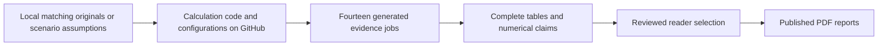

# Report to calculation map

This map connects the published **portfolio backtest** and **capital-inflow report** to their actual calculation code, configurations and generated evidence. It covers all 30 selected analytical tables, all 6 displayed figures, the 54 original selected dynamic prose claims and twelve descriptive summary bindings. It also identifies the static input/source/AI sections so assumptions and citations are not mistaken for simulation results.

Code and configuration links are pinned to the verified [7 October 2026 source snapshot](https://github.com/TheAlegsx/1_Repository/blob/48e7ca27a78a7ceddff900024d99ff0fce0bacfe/Finance/MSCI%20World%20Factor%20Strategy/README.md). Later documentation additions do not change that computational source. Report filenames are stable; their date is retained inside each PDF. The reports include blue highlighted links naming each calculation function or configuration and its role; financial results are unchanged; reader wording, display rounding and evidence-derived charts were revised on 8 October 2026.

## How to follow a result

1. Find the report table/section below. Open the **calculation** link for the numerical producer and the configuration link for its assumptions.
2. The **evidence path** is relative to `RUN`, the new output directory supplied to the [publication_reproduce.run](https://github.com/TheAlegsx/1_Repository/blob/48e7ca27a78a7ceddff900024d99ff0fce0bacfe/Finance/MSCI%20World%20Factor%20Strategy/src/factor_portfolio/publication_reproduce.py#L88) command, for example `outputs/my-reconstruction`. These output files are generated locally; they are not missing GitHub files and must not be linked as if uploaded.
3. [research_reader_selection_2026-10-06.json](https://github.com/TheAlegsx/1_Repository/blob/48e7ca27a78a7ceddff900024d99ff0fce0bacfe/Finance/MSCI%20World%20Factor%20Strategy/config/research_reader_selection_2026-10-06.json) selects the full source family, rows and columns. [research_reader_reports.select_table](https://github.com/TheAlegsx/1_Repository/blob/48e7ca27a78a7ceddff900024d99ff0fce0bacfe/Finance/MSCI%20World%20Factor%20Strategy/src/factor_portfolio/research_reader_reports.py#L62) keeps the source cells and their origins when presenting a smaller table. Rows/columns in the selection are **zero-based**.
4. A reconstructed reader also writes `RUN/readers/evidence/backtest_bindings.json` and `inflow_bindings.json`: displayed cells/claims, original row/field identifiers and figure hashes. These sidecars are the detailed audit trail after running the public code.

The real-data research accounts use [historical.simulate](https://github.com/TheAlegsx/1_Repository/blob/48e7ca27a78a7ceddff900024d99ff0fce0bacfe/Finance/MSCI%20World%20Factor%20Strategy/src/factor_portfolio/historical.py#L21) and [historical.metrics](https://github.com/TheAlegsx/1_Repository/blob/48e7ca27a78a7ceddff900024d99ff0fce0bacfe/Finance/MSCI%20World%20Factor%20Strategy/src/factor_portfolio/historical.py#L121) through [backtest_workflow.run_backtest_study](https://github.com/TheAlegsx/1_Repository/blob/48e7ca27a78a7ceddff900024d99ff0fce0bacfe/Finance/MSCI%20World%20Factor%20Strategy/src/factor_portfolio/backtest_workflow.py#L210). The separate [engine.run_backtest](https://github.com/TheAlegsx/1_Repository/blob/48e7ca27a78a7ceddff900024d99ff0fce0bacfe/Finance/MSCI%20World%20Factor%20Strategy/src/factor_portfolio/engine.py#L196) API is used by the artificial accounting example and other library controls; it should not be substituted for the configured research workflow. Low-level function defaults also do not select the primary policy: the [backtest_absolute_decoupled_2026-10-05.json](https://github.com/TheAlegsx/1_Repository/blob/48e7ca27a78a7ceddff900024d99ff0fce0bacfe/Finance/MSCI%20World%20Factor%20Strategy/config/backtest_absolute_decoupled_2026-10-05.json) explicitly selects `absolute_decoupled`.

## Portfolio backtest

[Open the published backtest PDF](../reports/MSCI_World_Factor_Strategy_Backtest.pdf) · [Report template](https://github.com/TheAlegsx/1_Repository/blob/main/Finance/MSCI%20World%20Factor%20Strategy/src/factor_portfolio/templates/research_backtest_reader_2026-10-06.md)

| Report location and status | Meaning and GitHub producer | Generated evidence under RUN |
| --- | --- | --- |
| [Table 1. Target allocation](https://github.com/TheAlegsx/1_Repository/blob/main/Finance/MSCI%20World%20Factor%20Strategy/src/factor_portfolio/templates/research_backtest_reader_2026-10-06.md#L23) 2.1 Allocation and trading rules **Specified assumption** | Weights and economic roles; no optimisation is claimed. [backtest_absolute_decoupled_2026-10-05.json](https://github.com/TheAlegsx/1_Repository/blob/48e7ca27a78a7ceddff900024d99ff0fce0bacfe/Finance/MSCI%20World%20Factor%20Strategy/config/backtest_absolute_decoupled_2026-10-05.json) | Configuration fields; displayed by [backtest_report.result_tables](https://github.com/TheAlegsx/1_Repository/blob/48e7ca27a78a7ceddff900024d99ff0fce0bacfe/Finance/MSCI%20World%20Factor%20Strategy/src/factor_portfolio/backtest_report.py#L74) Source family `backtest_01`; rows `null`; columns all. |
| [Table 3. Investment cost and measurement assumptions](https://github.com/TheAlegsx/1_Repository/blob/main/Finance/MSCI%20World%20Factor%20Strategy/src/factor_portfolio/templates/research_backtest_reader_2026-10-06.md#L68) 3.2 Accounting and costs **Specified assumptions and conversion arithmetic** | Borrowing markup, day count, commissions, duty, spread and CHF conversion. [backtest_absolute_decoupled_2026-10-05.json](https://github.com/TheAlegsx/1_Repository/blob/48e7ca27a78a7ceddff900024d99ff0fce0bacfe/Finance/MSCI%20World%20Factor%20Strategy/config/backtest_absolute_decoupled_2026-10-05.json) [config.SwissquoteStandardFeeSchedule](https://github.com/TheAlegsx/1_Repository/blob/48e7ca27a78a7ceddff900024d99ff0fce0bacfe/Finance/MSCI%20World%20Factor%20Strategy/src/factor_portfolio/config.py#L66) | Configuration fields; displayed by [backtest_report.result_tables](https://github.com/TheAlegsx/1_Repository/blob/48e7ca27a78a7ceddff900024d99ff0fce0bacfe/Finance/MSCI%20World%20Factor%20Strategy/src/factor_portfolio/backtest_report.py#L74) Source family `backtest_27`; rows `[4, 5, 6, 7, 8, 9]`; columns `[0, 1]`. |
| [Table 4. Unlevered control over the main sample](https://github.com/TheAlegsx/1_Repository/blob/main/Finance/MSCI%20World%20Factor%20Strategy/src/factor_portfolio/templates/research_backtest_reader_2026-10-06.md#L86) 4.1 Central MSCI World comparison **Calculated** | CAGR, volatility, drawdown, Sharpe and ending equity without borrowing. [historical.simulate](https://github.com/TheAlegsx/1_Repository/blob/48e7ca27a78a7ceddff900024d99ff0fce0bacfe/Finance/MSCI%20World%20Factor%20Strategy/src/factor_portfolio/historical.py#L21) [historical.metrics](https://github.com/TheAlegsx/1_Repository/blob/48e7ca27a78a7ceddff900024d99ff0fce0bacfe/Finance/MSCI%20World%20Factor%20Strategy/src/factor_portfolio/historical.py#L121) [backtest_absolute_decoupled_2026-10-05.json](https://github.com/TheAlegsx/1_Repository/blob/48e7ca27a78a7ceddff900024d99ff0fce0bacfe/Finance/MSCI%20World%20Factor%20Strategy/config/backtest_absolute_decoupled_2026-10-05.json) | `core/results/policy_metrics.csv` Source family `backtest_05`; rows `[0, 2]`; columns all. |
| [Table 5. Main portfolio and Core at a 1.25x target](https://github.com/TheAlegsx/1_Repository/blob/main/Finance/MSCI%20World%20Factor%20Strategy/src/factor_portfolio/templates/research_backtest_reader_2026-10-06.md#L90) 4.1 Central MSCI World comparison **Calculated** | Main 1.25x factor portfolio versus Core: return, risk and ending equity. [historical.simulate](https://github.com/TheAlegsx/1_Repository/blob/48e7ca27a78a7ceddff900024d99ff0fce0bacfe/Finance/MSCI%20World%20Factor%20Strategy/src/factor_portfolio/historical.py#L21) [historical.metrics](https://github.com/TheAlegsx/1_Repository/blob/48e7ca27a78a7ceddff900024d99ff0fce0bacfe/Finance/MSCI%20World%20Factor%20Strategy/src/factor_portfolio/historical.py#L121) [backtest_absolute_decoupled_2026-10-05.json](https://github.com/TheAlegsx/1_Repository/blob/48e7ca27a78a7ceddff900024d99ff0fce0bacfe/Finance/MSCI%20World%20Factor%20Strategy/config/backtest_absolute_decoupled_2026-10-05.json) | `core/results/policy_metrics.csv` Source family `backtest_06`; rows `[0, 2]`; columns all. |
| [Table 9. Main strategy and Dimensional at the 1.25x target](https://github.com/TheAlegsx/1_Repository/blob/main/Finance/MSCI%20World%20Factor%20Strategy/src/factor_portfolio/templates/research_backtest_reader_2026-10-06.md#L132) 4.2 Brief comparison with Dimensional **Calculated** | Same-target comparison with the Dimensional fund. [historical.simulate](https://github.com/TheAlegsx/1_Repository/blob/48e7ca27a78a7ceddff900024d99ff0fce0bacfe/Finance/MSCI%20World%20Factor%20Strategy/src/factor_portfolio/historical.py#L21) [historical.metrics](https://github.com/TheAlegsx/1_Repository/blob/48e7ca27a78a7ceddff900024d99ff0fce0bacfe/Finance/MSCI%20World%20Factor%20Strategy/src/factor_portfolio/historical.py#L121) [backtest_absolute_decoupled_2026-10-05.json](https://github.com/TheAlegsx/1_Repository/blob/48e7ca27a78a7ceddff900024d99ff0fce0bacfe/Finance/MSCI%20World%20Factor%20Strategy/config/backtest_absolute_decoupled_2026-10-05.json) | `core/results/policy_metrics.csv` Source family `backtest_06`; rows `[0, 3]`; columns all. |
| [Table 10. Factor portfolio at 2x and Amundi daily 2x: 30 September 2025–31 August 2026](https://github.com/TheAlegsx/1_Repository/blob/main/Finance/MSCI%20World%20Factor%20Strategy/src/factor_portfolio/templates/research_backtest_reader_2026-10-06.md#L140) 4.3 Portfolio at 2x versus the Amundi daily 2x ETF **Calculated** | Cumulative short-window factor 2x versus real daily 2x Amundi NAV; no duplicated Amundi borrowing charge. [backtest_products.product_comparison](https://github.com/TheAlegsx/1_Repository/blob/48e7ca27a78a7ceddff900024d99ff0fce0bacfe/Finance/MSCI%20World%20Factor%20Strategy/src/factor_portfolio/backtest_products.py#L55) [backtest_absolute_decoupled_2026-10-05.json](https://github.com/TheAlegsx/1_Repository/blob/48e7ca27a78a7ceddff900024d99ff0fce0bacfe/Finance/MSCI%20World%20Factor%20Strategy/config/backtest_absolute_decoupled_2026-10-05.json) [backtest_products_absolute_decoupled_2026-10-05.json](https://github.com/TheAlegsx/1_Repository/blob/48e7ca27a78a7ceddff900024d99ff0fce0bacfe/Finance/MSCI%20World%20Factor%20Strategy/config/backtest_products_absolute_decoupled_2026-10-05.json) | `expanded/products/product_overlap_metrics.csv` Source family `backtest_25`; rows `[1, 4]`; columns all. |
| [Table A1. Absolute/separate and capped-relative policies](https://github.com/TheAlegsx/1_Repository/blob/main/Finance/MSCI%20World%20Factor%20Strategy/src/factor_portfolio/templates/research_backtest_reader_2026-10-06.md#L178) Appendix A. Band Sensitivity **Calculated** | Absolute/separate and capped-relative outcomes at 1.00x/1.25x. [backtest_workflow.policy_comparison](https://github.com/TheAlegsx/1_Repository/blob/48e7ca27a78a7ceddff900024d99ff0fce0bacfe/Finance/MSCI%20World%20Factor%20Strategy/src/factor_portfolio/backtest_workflow.py#L161) [historical.simulate](https://github.com/TheAlegsx/1_Repository/blob/48e7ca27a78a7ceddff900024d99ff0fce0bacfe/Finance/MSCI%20World%20Factor%20Strategy/src/factor_portfolio/historical.py#L21) [backtest_absolute_decoupled_2026-10-05.json](https://github.com/TheAlegsx/1_Repository/blob/48e7ca27a78a7ceddff900024d99ff0fce0bacfe/Finance/MSCI%20World%20Factor%20Strategy/config/backtest_absolute_decoupled_2026-10-05.json) | `core/results/policy_metrics.csv` Source family `backtest_12`; rows `[1, 3, 8, 10]`; columns `[0, 1, 2, 3, 4]`. |
| [Table B1. Main portfolio alpha against unlevered Core](https://github.com/TheAlegsx/1_Repository/blob/main/Finance/MSCI%20World%20Factor%20Strategy/src/factor_portfolio/templates/research_backtest_reader_2026-10-06.md#L186) Appendix B. Statistical and Period Checks **Calculated** | Beta, annualised Jensen intercept and five-lag HAC confidence intervals; not a CAGR difference. [historical.metrics](https://github.com/TheAlegsx/1_Repository/blob/48e7ca27a78a7ceddff900024d99ff0fce0bacfe/Finance/MSCI%20World%20Factor%20Strategy/src/factor_portfolio/historical.py#L121) [backtest_absolute_decoupled_2026-10-05.json](https://github.com/TheAlegsx/1_Repository/blob/48e7ca27a78a7ceddff900024d99ff0fce0bacfe/Finance/MSCI%20World%20Factor%20Strategy/config/backtest_absolute_decoupled_2026-10-05.json) | `core/results/policy_metrics.csv` Source family `backtest_13`; rows `[0, 4]`; columns `[2, 3, 4, 5, 6]`. |
| [Table B2. Independently restarted retrospective periods at 1.25x](https://github.com/TheAlegsx/1_Repository/blob/main/Finance/MSCI%20World%20Factor%20Strategy/src/factor_portfolio/templates/research_backtest_reader_2026-10-06.md#L192) Appendix B. Statistical and Period Checks **Calculated** | Separately restarted early/later account results. [backtest_workflow.policy_comparison](https://github.com/TheAlegsx/1_Repository/blob/48e7ca27a78a7ceddff900024d99ff0fce0bacfe/Finance/MSCI%20World%20Factor%20Strategy/src/factor_portfolio/backtest_workflow.py#L161) [historical.metrics](https://github.com/TheAlegsx/1_Repository/blob/48e7ca27a78a7ceddff900024d99ff0fce0bacfe/Finance/MSCI%20World%20Factor%20Strategy/src/factor_portfolio/historical.py#L121) [backtest_absolute_decoupled_2026-10-05.json](https://github.com/TheAlegsx/1_Repository/blob/48e7ca27a78a7ceddff900024d99ff0fce0bacfe/Finance/MSCI%20World%20Factor%20Strategy/config/backtest_absolute_decoupled_2026-10-05.json) | `core/results/policy_metrics.csv` Source family `backtest_14`; rows `[4, 6, 12, 14]`; columns `[0, 1, 3, 4, 5, 6]`. |
| [Table B3. Financing-markup sensitivity above the reference rate](https://github.com/TheAlegsx/1_Repository/blob/main/Finance/MSCI%20World%20Factor%20Strategy/src/factor_portfolio/templates/research_backtest_reader_2026-10-06.md#L198) Appendix B. Statistical and Period Checks **Calculated** | Recalculate accounts across financing markups, full/later windows. [backtest_funding.funding_comparison](https://github.com/TheAlegsx/1_Repository/blob/48e7ca27a78a7ceddff900024d99ff0fce0bacfe/Finance/MSCI%20World%20Factor%20Strategy/src/factor_portfolio/backtest_funding.py#L77) [backtest_absolute_decoupled_2026-10-05.json](https://github.com/TheAlegsx/1_Repository/blob/48e7ca27a78a7ceddff900024d99ff0fce0bacfe/Finance/MSCI%20World%20Factor%20Strategy/config/backtest_absolute_decoupled_2026-10-05.json) [backtest_funding_absolute_decoupled_2026-10-05.json](https://github.com/TheAlegsx/1_Repository/blob/48e7ca27a78a7ceddff900024d99ff0fce0bacfe/Finance/MSCI%20World%20Factor%20Strategy/config/backtest_funding_absolute_decoupled_2026-10-05.json) | `expanded/results/funding_metrics.csv` Source family `backtest_21`; rows `[0, 5, 7, 9]`; columns all. |

**Static Table 2 (main analytical inputs, section 3.1)** describes the input series and periods. It is authored in the [reader template](https://github.com/TheAlegsx/1_Repository/blob/main/Finance/MSCI%20World%20Factor%20Strategy/src/factor_portfolio/templates/research_backtest_reader_2026-10-06.md#L40) and supported by [backtest_sources.json](https://github.com/TheAlegsx/1_Repository/blob/48e7ca27a78a7ceddff900024d99ff0fce0bacfe/Finance/MSCI%20World%20Factor%20Strategy/config/backtest_sources.json), [data.build_canonical_dataset](https://github.com/TheAlegsx/1_Repository/blob/48e7ca27a78a7ceddff900024d99ff0fce0bacfe/Finance/MSCI%20World%20Factor%20Strategy/src/factor_portfolio/data.py#L351), [market_data.read_bloomberg_hardcopy](https://github.com/TheAlegsx/1_Repository/blob/48e7ca27a78a7ceddff900024d99ff0fce0bacfe/Finance/MSCI%20World%20Factor%20Strategy/src/factor_portfolio/market_data.py#L125), [market_data.read_amundi_nav](https://github.com/TheAlegsx/1_Repository/blob/48e7ca27a78a7ceddff900024d99ff0fce0bacfe/Finance/MSCI%20World%20Factor%20Strategy/src/factor_portfolio/market_data.py#L249) and [rates.build_funding_dataset](https://github.com/TheAlegsx/1_Repository/blob/48e7ca27a78a7ceddff900024d99ff0fce0bacfe/Finance/MSCI%20World%20Factor%20Strategy/src/factor_portfolio/rates.py#L192). It is not an additional simulation result.

The displayed table families are formatted by [backtest_report.result_tables](https://github.com/TheAlegsx/1_Repository/blob/48e7ca27a78a7ceddff900024d99ff0fce0bacfe/Finance/MSCI%20World%20Factor%20Strategy/src/factor_portfolio/backtest_report.py#L74). In particular `backtest_06` feeds both Table 5 (factor/Core rows 0/2) and Table 6 (factor/Dimensional rows 0/3). Formatting/selection is separate from the underlying investment simulation.

## Capital inflows and fund economics

[Open the published capital-inflow PDF](../reports/Capital_Inflows_Fund_Economics.pdf) · [Report template](https://github.com/TheAlegsx/1_Repository/blob/main/Finance/MSCI%20World%20Factor%20Strategy/src/factor_portfolio/templates/research_inflow_reader_2026-10-06.md)

| Report location and status | Meaning and GitHub producer | Generated evidence under RUN |
| --- | --- | --- |
| [Table 1. Acquisition schedules before loss-year cuts](https://github.com/TheAlegsx/1_Repository/blob/main/Finance/MSCI%20World%20Factor%20Strategy/src/factor_portfolio/templates/research_inflow_reader_2026-10-06.md#L33) 2.1 Client acquisition and retention **Specified schedules with arithmetic** | Client equivalents and scheduled gross subscriptions before stress cuts. [inflow_report_tables.report_tables](https://github.com/TheAlegsx/1_Repository/blob/48e7ca27a78a7ceddff900024d99ff0fce0bacfe/Finance/MSCI%20World%20Factor%20Strategy/src/factor_portfolio/inflow_report_tables.py#L63) [inflow_acquisition.json](https://github.com/TheAlegsx/1_Repository/blob/48e7ca27a78a7ceddff900024d99ff0fce0bacfe/Finance/MSCI%20World%20Factor%20Strategy/config/inflow_acquisition.json) | `inflow_v4/config/inflow_acquisition.json` Source family `01_acquisition_assumptions`; rows all; columns all. |
| [Table 2. Central business assumptions and sensitivities](https://github.com/TheAlegsx/1_Repository/blob/main/Finance/MSCI%20World%20Factor%20Strategy/src/factor_portfolio/templates/research_inflow_reader_2026-10-06.md#L43) 2.2 Fees and costs **Specified assumptions** | Budget, setup/acquisition/servicing costs, fee and receipt fractions. [inflow_report_tables.report_tables](https://github.com/TheAlegsx/1_Repository/blob/48e7ca27a78a7ceddff900024d99ff0fce0bacfe/Finance/MSCI%20World%20Factor%20Strategy/src/factor_portfolio/inflow_report_tables.py#L63) [inflow_acquisition.json](https://github.com/TheAlegsx/1_Repository/blob/48e7ca27a78a7ceddff900024d99ff0fce0bacfe/Finance/MSCI%20World%20Factor%20Strategy/config/inflow_acquisition.json) | `inflow_v4/config/inflow_acquisition.json` Source family `02_business_assumptions`; rows all; columns `[0, 1]`. |
| [Table 3. Steady acquisition: coupled execution and overlay](https://github.com/TheAlegsx/1_Repository/blob/main/Finance/MSCI%20World%20Factor%20Strategy/src/factor_portfolio/templates/research_inflow_reader_2026-10-06.md#L89) 4.1 The strategy is actually executed with flows **Calculated historical path plus hypothetical flows** | Coupled actual-date unit TWR, overlay TWR and external MWR. [coupled_inflow_accounting.simulate_coupled](https://github.com/TheAlegsx/1_Repository/blob/48e7ca27a78a7ceddff900024d99ff0fce0bacfe/Finance/MSCI%20World%20Factor%20Strategy/src/factor_portfolio/coupled_inflow_accounting.py#L48) [historical_inflow_interpretation.compare_accounts](https://github.com/TheAlegsx/1_Repository/blob/48e7ca27a78a7ceddff900024d99ff0fce0bacfe/Finance/MSCI%20World%20Factor%20Strategy/src/factor_portfolio/historical_inflow_interpretation.py#L20) [backtest_absolute_decoupled_2026-10-05.json](https://github.com/TheAlegsx/1_Repository/blob/48e7ca27a78a7ceddff900024d99ff0fce0bacfe/Finance/MSCI%20World%20Factor%20Strategy/config/backtest_absolute_decoupled_2026-10-05.json); [historical_inflows_execution_v2_2026-10-05.json](https://github.com/TheAlegsx/1_Repository/blob/48e7ca27a78a7ceddff900024d99ff0fce0bacfe/Finance/MSCI%20World%20Factor%20Strategy/config/historical_inflows_execution_v2_2026-10-05.json) | `interpretation/coupled_overlay_comparison.csv` Source family `historical_selected`; rows all; columns `[0, 1, 2, 4]`. |
| [Table 7. Main strategy: historical acquisition outcomes, USD million](https://github.com/TheAlegsx/1_Repository/blob/main/Finance/MSCI%20World%20Factor%20Strategy/src/factor_portfolio/templates/research_inflow_reader_2026-10-06.md#L121) 4.2 Ownership and cash already returned to investors **Calculated historical path plus hypothetical flows** | Owner equity, external closing equity, total net assets and redeemed cash. [coupled_inflow_accounting.simulate_coupled](https://github.com/TheAlegsx/1_Repository/blob/48e7ca27a78a7ceddff900024d99ff0fce0bacfe/Finance/MSCI%20World%20Factor%20Strategy/src/factor_portfolio/coupled_inflow_accounting.py#L48) [backtest_absolute_decoupled_2026-10-05.json](https://github.com/TheAlegsx/1_Repository/blob/48e7ca27a78a7ceddff900024d99ff0fce0bacfe/Finance/MSCI%20World%20Factor%20Strategy/config/backtest_absolute_decoupled_2026-10-05.json); [inflow_acquisition.json](https://github.com/TheAlegsx/1_Repository/blob/48e7ca27a78a7ceddff900024d99ff0fce0bacfe/Finance/MSCI%20World%20Factor%20Strategy/config/inflow_acquisition.json); [historical_inflows_contract_2026-10-05.json](https://github.com/TheAlegsx/1_Repository/blob/48e7ca27a78a7ceddff900024d99ff0fce0bacfe/Finance/MSCI%20World%20Factor%20Strategy/config/historical_inflows_contract_2026-10-05.json) | `historical/pilot/coupled_headline.csv` Source family `historical_ownership`; rows `[0, 1, 2, 3]`; columns `[1, 3, 4, 5, 6]`. |
| [Table 8. Main strategy, steady acquisition: historical manager accounts, USD](https://github.com/TheAlegsx/1_Repository/blob/main/Finance/MSCI%20World%20Factor%20Strategy/src/factor_portfolio/templates/research_inflow_reader_2026-10-06.md#L131) 4.3 Manager cash and working capital **Calculated historical business scenarios** | External fee receipts, costs, terminal cash and peak funding gap; separate conditional owner-fee receipts. [historical_inflow_diagnostics.manager_accounts](https://github.com/TheAlegsx/1_Repository/blob/48e7ca27a78a7ceddff900024d99ff0fce0bacfe/Finance/MSCI%20World%20Factor%20Strategy/src/factor_portfolio/historical_inflow_diagnostics.py#L94) [inflow_acquisition.json](https://github.com/TheAlegsx/1_Repository/blob/48e7ca27a78a7ceddff900024d99ff0fce0bacfe/Finance/MSCI%20World%20Factor%20Strategy/config/inflow_acquisition.json) | `historical/manager_headline.csv` Source family `historical_manager`; rows `[0, 1]`; columns `[1, 2, 3, 4, 5, 6]`. |
| [Table 9. Acquisition under the hypothetical 6% path](https://github.com/TheAlegsx/1_Repository/blob/main/Finance/MSCI%20World%20Factor%20Strategy/src/factor_portfolio/templates/research_inflow_reader_2026-10-06.md#L149) 5.1 Raising assets does not establish profitable operations **Calculated hypothetical scenarios** | Ten-year owner/external equity and manager cash under the 6% path. [inflow_scenarios.acquisition](https://github.com/TheAlegsx/1_Repository/blob/48e7ca27a78a7ceddff900024d99ff0fce0bacfe/Finance/MSCI%20World%20Factor%20Strategy/src/factor_portfolio/inflow_scenarios.py#L14) [inflow_results.annual_and_headline](https://github.com/TheAlegsx/1_Repository/blob/48e7ca27a78a7ceddff900024d99ff0fce0bacfe/Finance/MSCI%20World%20Factor%20Strategy/src/factor_portfolio/inflow_results.py#L10) [inflow_acquisition.json](https://github.com/TheAlegsx/1_Repository/blob/48e7ca27a78a7ceddff900024d99ff0fce0bacfe/Finance/MSCI%20World%20Factor%20Strategy/config/inflow_acquisition.json) | `inflow_v4/tables/acquisition_headline.csv` Source family `03_acquisition_outcomes`; rows all; columns `[0, 1, 2, 5]`. |
| [Table 10. Steady acquisition: fee sensitivity under 6%](https://github.com/TheAlegsx/1_Repository/blob/main/Finance/MSCI%20World%20Factor%20Strategy/src/factor_portfolio/templates/research_inflow_reader_2026-10-06.md#L159) 5.2 The fee rate and the amount actually received **Calculated hypothetical sensitivities** | Fee-rate changes with the same ticket, growth and steady-acquisition selectors. [inflow_results.sensitivity_tables](https://github.com/TheAlegsx/1_Repository/blob/48e7ca27a78a7ceddff900024d99ff0fce0bacfe/Finance/MSCI%20World%20Factor%20Strategy/src/factor_portfolio/inflow_results.py#L55) [inflow_scenarios.acquisition](https://github.com/TheAlegsx/1_Repository/blob/48e7ca27a78a7ceddff900024d99ff0fce0bacfe/Finance/MSCI%20World%20Factor%20Strategy/src/factor_portfolio/inflow_scenarios.py#L14) [inflow_acquisition.json](https://github.com/TheAlegsx/1_Repository/blob/48e7ca27a78a7ceddff900024d99ff0fce0bacfe/Finance/MSCI%20World%20Factor%20Strategy/config/inflow_acquisition.json) | `inflow_v4/tables/fee_ticket_receipt_sensitivity.csv` Source family `07_fee_economics`; rows all; columns `[0, 1, 3, 4]`. |
| [Table 11. Selected timing cases under 6%](https://github.com/TheAlegsx/1_Repository/blob/main/Finance/MSCI%20World%20Factor%20Strategy/src/factor_portfolio/templates/research_inflow_reader_2026-10-06.md#L173) 5.3 Equal gross subscriptions at different times **Calculated hypothetical timing** | Same gross subscriptions distributed across different months. [inflow_scenarios.timing](https://github.com/TheAlegsx/1_Repository/blob/48e7ca27a78a7ceddff900024d99ff0fce0bacfe/Finance/MSCI%20World%20Factor%20Strategy/src/factor_portfolio/inflow_scenarios.py#L80) [inflows.simulate](https://github.com/TheAlegsx/1_Repository/blob/48e7ca27a78a7ceddff900024d99ff0fce0bacfe/Finance/MSCI%20World%20Factor%20Strategy/src/factor_portfolio/inflows.py#L12) [inflow_acquisition.json](https://github.com/TheAlegsx/1_Repository/blob/48e7ca27a78a7ceddff900024d99ff0fce0bacfe/Finance/MSCI%20World%20Factor%20Strategy/config/inflow_acquisition.json); [inflow_timing.json](https://github.com/TheAlegsx/1_Repository/blob/48e7ca27a78a7ceddff900024d99ff0fce0bacfe/Finance/MSCI%20World%20Factor%20Strategy/config/inflow_timing.json) | `inflow_v4/tables/timing_headline.csv` Source family `04_selected_timing_outcomes`; rows all; columns `[0, 1, 2, 3]`. |
| [Table A1. Closing total fund assets under all twenty acquisition combinations, USD million](https://github.com/TheAlegsx/1_Repository/blob/main/Finance/MSCI%20World%20Factor%20Strategy/src/factor_portfolio/templates/research_inflow_reader_2026-10-06.md#L205) Appendix A. Hypothetical Scenario Overview **Calculated hypothetical scenarios** | All 20 acquisition/return combinations; final total fund assets. [inflow_scenarios.acquisition](https://github.com/TheAlegsx/1_Repository/blob/48e7ca27a78a7ceddff900024d99ff0fce0bacfe/Finance/MSCI%20World%20Factor%20Strategy/src/factor_portfolio/inflow_scenarios.py#L14) [inflow_results.annual_and_headline](https://github.com/TheAlegsx/1_Repository/blob/48e7ca27a78a7ceddff900024d99ff0fce0bacfe/Finance/MSCI%20World%20Factor%20Strategy/src/factor_portfolio/inflow_results.py#L10) [inflow_acquisition.json](https://github.com/TheAlegsx/1_Repository/blob/48e7ca27a78a7ceddff900024d99ff0fce0bacfe/Finance/MSCI%20World%20Factor%20Strategy/config/inflow_acquisition.json) | `inflow_v4/tables/acquisition_headline.csv` Source family `09_acquisition_return_matrix`; rows all; columns all. |
| [Table A2. External-business funding and conditional owner-fee receipts, USD](https://github.com/TheAlegsx/1_Repository/blob/main/Finance/MSCI%20World%20Factor%20Strategy/src/factor_portfolio/templates/research_inflow_reader_2026-10-06.md#L211) Appendix A. Hypothetical Scenario Overview **Calculated hypothetical sensitivities** | External-business deficits versus conditional owner-fee funding. [inflow_treasury.treasury_controls](https://github.com/TheAlegsx/1_Repository/blob/48e7ca27a78a7ceddff900024d99ff0fce0bacfe/Finance/MSCI%20World%20Factor%20Strategy/src/factor_portfolio/inflow_treasury.py#L43) [inflow_treasury.sensitivity_controls](https://github.com/TheAlegsx/1_Repository/blob/48e7ca27a78a7ceddff900024d99ff0fce0bacfe/Finance/MSCI%20World%20Factor%20Strategy/src/factor_portfolio/inflow_treasury.py#L77) [inflow_acquisition.json](https://github.com/TheAlegsx/1_Repository/blob/48e7ca27a78a7ceddff900024d99ff0fce0bacfe/Finance/MSCI%20World%20Factor%20Strategy/config/inflow_acquisition.json); [inflow_controls.json](https://github.com/TheAlegsx/1_Repository/blob/48e7ca27a78a7ceddff900024d99ff0fce0bacfe/Finance/MSCI%20World%20Factor%20Strategy/config/inflow_controls.json) | `inflow_v4/controls/treasury_controls.json` `inflow_v4/controls/funding_sensitivity.json` Source family `08_treasury_definitions`; rows all; columns all. |
| [Table B1. Aggregate external investor returns under the hypothetical later loss](https://github.com/TheAlegsx/1_Repository/blob/main/Finance/MSCI%20World%20Factor%20Strategy/src/factor_portfolio/templates/research_inflow_reader_2026-10-06.md#L219) Appendix B. Return and Timing Controls **Calculated hypothetical investor returns** | Investor unit TWR and aggregate external cash-flow MWR. [inflow_returns.external_investor_returns](https://github.com/TheAlegsx/1_Repository/blob/48e7ca27a78a7ceddff900024d99ff0fce0bacfe/Finance/MSCI%20World%20Factor%20Strategy/src/factor_portfolio/inflow_returns.py#L65) [inflow_returns.money_weighted_return](https://github.com/TheAlegsx/1_Repository/blob/48e7ca27a78a7ceddff900024d99ff0fce0bacfe/Finance/MSCI%20World%20Factor%20Strategy/src/factor_portfolio/inflow_returns.py#L14) [inflow_returns.json](https://github.com/TheAlegsx/1_Repository/blob/48e7ca27a78a7ceddff900024d99ff0fce0bacfe/Finance/MSCI%20World%20Factor%20Strategy/config/inflow_returns.json); [inflow_timing.json](https://github.com/TheAlegsx/1_Repository/blob/48e7ca27a78a7ceddff900024d99ff0fce0bacfe/Finance/MSCI%20World%20Factor%20Strategy/config/inflow_timing.json) | `inflow_v4/returns/return_diagnostics.json` Source family `05_investor_returns`; rows all; columns all. |
| [Table B2. Within-year loss placement with matched annual net unit performance](https://github.com/TheAlegsx/1_Repository/blob/main/Finance/MSCI%20World%20Factor%20Strategy/src/factor_portfolio/templates/research_inflow_reader_2026-10-06.md#L225) Appendix B. Return and Timing Controls **Calculated hypothetical controls** | Within-year loss-placement spread with matching annual net unit performance. [inflow_controls.loss_controls](https://github.com/TheAlegsx/1_Repository/blob/48e7ca27a78a7ceddff900024d99ff0fce0bacfe/Finance/MSCI%20World%20Factor%20Strategy/src/factor_portfolio/inflow_controls.py#L99) [inflow_acquisition.json](https://github.com/TheAlegsx/1_Repository/blob/48e7ca27a78a7ceddff900024d99ff0fce0bacfe/Finance/MSCI%20World%20Factor%20Strategy/config/inflow_acquisition.json); [inflow_timing.json](https://github.com/TheAlegsx/1_Repository/blob/48e7ca27a78a7ceddff900024d99ff0fce0bacfe/Finance/MSCI%20World%20Factor%20Strategy/config/inflow_timing.json); [inflow_controls.json](https://github.com/TheAlegsx/1_Repository/blob/48e7ca27a78a7ceddff900024d99ff0fce0bacfe/Finance/MSCI%20World%20Factor%20Strategy/config/inflow_controls.json) | `inflow_v4/controls/loss_controls.json` Source family `06_loss_placement_ranges`; rows all; columns all. |
| [Table B3. Historical no-flow/no-added-fund-fee controls](https://github.com/TheAlegsx/1_Repository/blob/main/Finance/MSCI%20World%20Factor%20Strategy/src/factor_portfolio/templates/research_inflow_reader_2026-10-06.md#L231) Appendix B. Return and Timing Controls **Calculated historical controls** | No-flow/no-added-fund-fee account; owner equity, trading and financing costs. [historical_inflow_replay.calculate_replays](https://github.com/TheAlegsx/1_Repository/blob/48e7ca27a78a7ceddff900024d99ff0fce0bacfe/Finance/MSCI%20World%20Factor%20Strategy/src/factor_portfolio/historical_inflow_replay.py#L22) [coupled_inflow_accounting.simulate_coupled](https://github.com/TheAlegsx/1_Repository/blob/48e7ca27a78a7ceddff900024d99ff0fce0bacfe/Finance/MSCI%20World%20Factor%20Strategy/src/factor_portfolio/coupled_inflow_accounting.py#L48) [backtest_absolute_decoupled_2026-10-05.json](https://github.com/TheAlegsx/1_Repository/blob/48e7ca27a78a7ceddff900024d99ff0fce0bacfe/Finance/MSCI%20World%20Factor%20Strategy/config/backtest_absolute_decoupled_2026-10-05.json); [historical_inflows_execution_v2_2026-10-05.json](https://github.com/TheAlegsx/1_Repository/blob/48e7ca27a78a7ceddff900024d99ff0fce0bacfe/Finance/MSCI%20World%20Factor%20Strategy/config/historical_inflows_execution_v2_2026-10-05.json) | `historical/pilot/coupled_headline.csv` Source family `historical_controls`; rows all; columns `[0, 2, 3, 4, 5]`. |

### Historical versus hypothetical paths

The historical branch uses actual-date market observations over **3 October 2014–3 October 2024**, the same 60/15/10/15 allocation and absolute ±5-percentage-point bands and separate 1.25x leverage rule. [historical_inflow_replay.calculate_replays](https://github.com/TheAlegsx/1_Repository/blob/48e7ca27a78a7ceddff900024d99ff0fce0bacfe/Finance/MSCI%20World%20Factor%20Strategy/src/factor_portfolio/historical_inflow_replay.py#L22) combines the no-flow investment baseline, [coupled_inflow_accounting.simulate_coupled](https://github.com/TheAlegsx/1_Repository/blob/48e7ca27a78a7ceddff900024d99ff0fce0bacfe/Finance/MSCI%20World%20Factor%20Strategy/src/factor_portfolio/coupled_inflow_accounting.py#L48) and the overlay diagnostic. [historical_inflow_diagnostics.dated_mwr](https://github.com/TheAlegsx/1_Repository/blob/48e7ca27a78a7ceddff900024d99ff0fce0bacfe/Finance/MSCI%20World%20Factor%20Strategy/src/factor_portfolio/historical_inflow_diagnostics.py#L29) uses the actual cash-flow dates for historical MWR. [historical_inflow_interpretation.compare_accounts](https://github.com/TheAlegsx/1_Repository/blob/48e7ca27a78a7ceddff900024d99ff0fce0bacfe/Finance/MSCI%20World%20Factor%20Strategy/src/factor_portfolio/historical_inflow_interpretation.py#L20) compares coupled and overlay outcomes. The funding/fee/flow histories remain model accounts; the fundraising schedules are hypothetical.

The flat/6%/early-loss/later-loss paths are **specified assumptions** in [inflow_acquisition.json](https://github.com/TheAlegsx/1_Repository/blob/48e7ca27a78a7ceddff900024d99ff0fce0bacfe/Finance/MSCI%20World%20Factor%20Strategy/config/inflow_acquisition.json), not extrapolations of the backtest CAGR. [inflow_scenarios.acquisition](https://github.com/TheAlegsx/1_Repository/blob/48e7ca27a78a7ceddff900024d99ff0fce0bacfe/Finance/MSCI%20World%20Factor%20Strategy/src/factor_portfolio/inflow_scenarios.py#L14) and [inflow_scenarios.timing](https://github.com/TheAlegsx/1_Repository/blob/48e7ca27a78a7ceddff900024d99ff0fce0bacfe/Finance/MSCI%20World%20Factor%20Strategy/src/factor_portfolio/inflow_scenarios.py#L80) turn those inputs into monthly accounts; [inflow_results.build_results](https://github.com/TheAlegsx/1_Repository/blob/48e7ca27a78a7ceddff900024d99ff0fce0bacfe/Finance/MSCI%20World%20Factor%20Strategy/src/factor_portfolio/inflow_results.py#L90) produces the scenario/sensitivity summaries. [inflow_report_tables.report_tables](https://github.com/TheAlegsx/1_Repository/blob/48e7ca27a78a7ceddff900024d99ff0fce0bacfe/Finance/MSCI%20World%20Factor%20Strategy/src/factor_portfolio/inflow_report_tables.py#L63) formats the hypothetical table families, while [coordinated_inflow_report.historical_content](https://github.com/TheAlegsx/1_Repository/blob/48e7ca27a78a7ceddff900024d99ff0fce0bacfe/Finance/MSCI%20World%20Factor%20Strategy/src/factor_portfolio/coordinated_inflow_report.py#L84) formats the historical tables.

## Figures

| Figure | Plot producer on GitHub | Inputs and generated figure |
| --- | --- | --- |
| Backtest Figure 1, equity | [reader_figures.render](https://github.com/TheAlegsx/1_Repository/blob/24979b0b422c1f016a4b3a51e84420b3d701b5f7/Finance/MSCI%20World%20Factor%20Strategy/src/factor_portfolio/reader_figures.py#L15) | `complete_reports/backtest/figures/figure_data.csv` → `readers/figures/backtest_equity.png`; plotted values retained in the adjacent JSON. |
| Backtest Figure 2, drawdown | [reader_figures.render](https://github.com/TheAlegsx/1_Repository/blob/24979b0b422c1f016a4b3a51e84420b3d701b5f7/Finance/MSCI%20World%20Factor%20Strategy/src/factor_portfolio/reader_figures.py#L15) | `complete_reports/backtest/figures/figure_data.csv` → `readers/figures/backtest_drawdown.png`; plotted values retained in the adjacent JSON. |
| Inflow Figure 1, investor groups and separate manager | [reader_figures.render](https://github.com/TheAlegsx/1_Repository/blob/24979b0b422c1f016a4b3a51e84420b3d701b5f7/Finance/MSCI%20World%20Factor%20Strategy/src/factor_portfolio/reader_figures.py#L15) | Sealed historical tables or figure-data CSV → `readers/figures/inflow_accounts.png`; exact input hash and plotted values retained in the adjacent JSON. |
| Inflow Figure 2, unit NAV and relative wealth | [reader_figures.render](https://github.com/TheAlegsx/1_Repository/blob/24979b0b422c1f016a4b3a51e84420b3d701b5f7/Finance/MSCI%20World%20Factor%20Strategy/src/factor_portfolio/reader_figures.py#L15) | Sealed historical tables or figure-data CSV → `readers/figures/inflow_historical_nav.png`; exact input hash and plotted values retained in the adjacent JSON. |
| Inflow Figure 3, external fee receipts versus business costs | [reader_figures.render](https://github.com/TheAlegsx/1_Repository/blob/24979b0b422c1f016a4b3a51e84420b3d701b5f7/Finance/MSCI%20World%20Factor%20Strategy/src/factor_portfolio/reader_figures.py#L15) | Sealed historical tables or figure-data CSV → `readers/figures/inflow_manager_cash.png`; exact input hash and plotted values retained in the adjacent JSON. |

Figure values are retained in `complete_reports/backtest/figures/figure_data.csv` and `complete_reports/inflow/figures/historical/figure_data.csv`. Reader figures are copied as bitmaps after source/hash checks; the PDF renderer does not recalculate returns.

## Prose numbers and their exact origins

These 56 selected tokens are the dynamically bound numeric statements. The same token can occur in several paragraphs. The linked template shows each report location; CSV row numbers are zero-based **data rows excluding the header**, consistent with the retained original pandas index. Selectors identify hypothetical scenarios, not actual named customers.

### Backtest text

| Bound token and report location | Type | Exact origin after reconstruction |
| --- | --- | --- |
| [claim:capital](https://github.com/TheAlegsx/1_Repository/blob/main/Finance/MSCI%20World%20Factor%20Strategy/src/factor_portfolio/templates/research_backtest_reader_2026-10-06.md#L31) 2.1 Allocation and trading rules | Configured/derived assumption | [backtest_absolute_decoupled_2026-10-05.json](https://github.com/TheAlegsx/1_Repository/blob/48e7ca27a78a7ceddff900024d99ff0fce0bacfe/Finance/MSCI%20World%20Factor%20Strategy/config/backtest_absolute_decoupled_2026-10-05.json) · `initial_equity_usd` [backtest_absolute_decoupled_2026-10-05.json](https://github.com/TheAlegsx/1_Repository/blob/48e7ca27a78a7ceddff900024d99ff0fce0bacfe/Finance/MSCI%20World%20Factor%20Strategy/config/backtest_absolute_decoupled_2026-10-05.json) · `primary_leverage` Expression: capital times exposure or exposure minus one |
| [claim:debt](https://github.com/TheAlegsx/1_Repository/blob/main/Finance/MSCI%20World%20Factor%20Strategy/src/factor_portfolio/templates/research_backtest_reader_2026-10-06.md#L31) 2.1 Allocation and trading rules | Configured/derived assumption | [backtest_absolute_decoupled_2026-10-05.json](https://github.com/TheAlegsx/1_Repository/blob/48e7ca27a78a7ceddff900024d99ff0fce0bacfe/Finance/MSCI%20World%20Factor%20Strategy/config/backtest_absolute_decoupled_2026-10-05.json) · `initial_equity_usd` [backtest_absolute_decoupled_2026-10-05.json](https://github.com/TheAlegsx/1_Repository/blob/48e7ca27a78a7ceddff900024d99ff0fce0bacfe/Finance/MSCI%20World%20Factor%20Strategy/config/backtest_absolute_decoupled_2026-10-05.json) · `primary_leverage` Expression: capital times exposure or exposure minus one |
| [claim:gross](https://github.com/TheAlegsx/1_Repository/blob/main/Finance/MSCI%20World%20Factor%20Strategy/src/factor_portfolio/templates/research_backtest_reader_2026-10-06.md#L31) 2.1 Allocation and trading rules | Configured/derived assumption | [backtest_absolute_decoupled_2026-10-05.json](https://github.com/TheAlegsx/1_Repository/blob/48e7ca27a78a7ceddff900024d99ff0fce0bacfe/Finance/MSCI%20World%20Factor%20Strategy/config/backtest_absolute_decoupled_2026-10-05.json) · `initial_equity_usd` [backtest_absolute_decoupled_2026-10-05.json](https://github.com/TheAlegsx/1_Repository/blob/48e7ca27a78a7ceddff900024d99ff0fce0bacfe/Finance/MSCI%20World%20Factor%20Strategy/config/backtest_absolute_decoupled_2026-10-05.json) · `primary_leverage` Expression: capital times exposure or exposure minus one |
| [claim:intervals](https://github.com/TheAlegsx/1_Repository/blob/main/Finance/MSCI%20World%20Factor%20Strategy/src/factor_portfolio/templates/research_backtest_reader_2026-10-06.md#L58) 3.1 Inputs and common calendar | Calculated result | `core/results/policy_metrics.csv` row 10 · `observations` Expression: levels minus one |
| [claim:issuer_count](https://github.com/TheAlegsx/1_Repository/blob/main/Finance/MSCI%20World%20Factor%20Strategy/src/factor_portfolio/templates/research_backtest_reader_2026-10-06.md#L60) 3.1 Inputs and common calendar | Calculated result | `issuer/published_issuer_return_comparison.csv` Expression: row count |
| [claim:issuer_max_gap](https://github.com/TheAlegsx/1_Repository/blob/main/Finance/MSCI%20World%20Factor%20Strategy/src/factor_portfolio/templates/research_backtest_reader_2026-10-06.md#L60) 3.1 Inputs and common calendar | Calculated result | `issuer/published_issuer_return_comparison.csv` · `difference_percentage_points` Expression: max absolute published/reconstructed central difference |
| [claim:levels](https://github.com/TheAlegsx/1_Repository/blob/main/Finance/MSCI%20World%20Factor%20Strategy/src/factor_portfolio/templates/research_backtest_reader_2026-10-06.md#L58) 3.1 Inputs and common calendar | Calculated result | `core/results/policy_metrics.csv` row 10 · `observations` |
| [claim:levered_annualised_volatility](https://github.com/TheAlegsx/1_Repository/blob/main/Finance/MSCI%20World%20Factor%20Strategy/src/factor_portfolio/templates/research_backtest_reader_2026-10-06.md#L96) 4.1 Central MSCI World comparison | Calculated result | `core/results/policy_metrics.csv` row 10 · `annualised_volatility` |
| [claim:levered_cagr](https://github.com/TheAlegsx/1_Repository/blob/main/Finance/MSCI%20World%20Factor%20Strategy/src/factor_portfolio/templates/research_backtest_reader_2026-10-06.md#L9) Abstract; 4.1 Central MSCI World comparison | Calculated result | `core/results/policy_metrics.csv` row 10 · `cagr` |
| [claim:levered_gap_core](https://github.com/TheAlegsx/1_Repository/blob/main/Finance/MSCI%20World%20Factor%20Strategy/src/factor_portfolio/templates/research_backtest_reader_2026-10-06.md#L94) Abstract; 4.1 Central MSCI World comparison | Calculated result | `core/results/policy_metrics.csv` row 10 · `cagr` `core/results/policy_metrics.csv` row 16 · `cagr` Expression: factor cagr minus comparator cagr |
| [claim:levered_gap_dimensional](https://github.com/TheAlegsx/1_Repository/blob/main/Finance/MSCI%20World%20Factor%20Strategy/src/factor_portfolio/templates/research_backtest_reader_2026-10-06.md#L136) 4.2 Brief comparison with Dimensional | Calculated result | `core/results/policy_metrics.csv` row 10 · `cagr` `core/results/policy_metrics.csv` row 17 · `cagr` Expression: factor cagr minus comparator cagr |
| [claim:levered_maximum_drawdown](https://github.com/TheAlegsx/1_Repository/blob/main/Finance/MSCI%20World%20Factor%20Strategy/src/factor_portfolio/templates/research_backtest_reader_2026-10-06.md#L96) 4.1 Central MSCI World comparison | Calculated result | `core/results/policy_metrics.csv` row 10 · `maximum_drawdown` |
| [claim:unlevered_annualised_volatility](https://github.com/TheAlegsx/1_Repository/blob/main/Finance/MSCI%20World%20Factor%20Strategy/src/factor_portfolio/templates/research_backtest_reader_2026-10-06.md#L96) 4.1 Central MSCI World comparison | Calculated result | `core/results/policy_metrics.csv` row 1 · `annualised_volatility` |
| [claim:unlevered_cagr](https://github.com/TheAlegsx/1_Repository/blob/main/Finance/MSCI%20World%20Factor%20Strategy/src/factor_portfolio/templates/research_backtest_reader_2026-10-06.md#L96) Abstract; 4.1 Central MSCI World comparison | Calculated result | `core/results/policy_metrics.csv` row 1 · `cagr` |
| [claim:unlevered_gap_core](https://github.com/TheAlegsx/1_Repository/blob/main/Finance/MSCI%20World%20Factor%20Strategy/src/factor_portfolio/templates/research_backtest_reader_2026-10-06.md#L94) 4.1 Central MSCI World comparison | Calculated result | `core/results/policy_metrics.csv` row 1 · `cagr` `core/results/policy_metrics.csv` row 7 · `cagr` Expression: factor cagr minus comparator cagr |
| [claim:unlevered_maximum_drawdown](https://github.com/TheAlegsx/1_Repository/blob/main/Finance/MSCI%20World%20Factor%20Strategy/src/factor_portfolio/templates/research_backtest_reader_2026-10-06.md#L96) 4.1 Central MSCI World comparison | Calculated result | `core/results/policy_metrics.csv` row 1 · `maximum_drawdown` |

### Capital-inflow text

| Bound token and report location | Type | Exact origin after reconstruction |
| --- | --- | --- |
| [claim:early_loss_range](https://github.com/TheAlegsx/1_Repository/blob/main/Finance/MSCI%20World%20Factor%20Strategy/src/factor_portfolio/templates/research_inflow_reader_2026-10-06.md#L181) 5.3 Equal gross subscriptions at different times | Calculated result | `inflow_v4/controls/loss_controls.json` · `cases.total_aum`; selector `{"flow":"early_steps","layer":"timing","mode":"same_net_annual_return","return_scenario":"late_loss"}` Expression: maximum minus minimum |
| [claim:fee_bps](https://github.com/TheAlegsx/1_Repository/blob/main/Finance/MSCI%20World%20Factor%20Strategy/src/factor_portfolio/templates/research_inflow_reader_2026-10-06.md#L77) 3. No-External-Investor Reference | Configured/derived assumption | [inflow_acquisition.json](https://github.com/TheAlegsx/1_Repository/blob/48e7ca27a78a7ceddff900024d99ff0fce0bacfe/Finance/MSCI%20World%20Factor%20Strategy/config/inflow_acquisition.json) · `annual_fee` |
| [claim:growth_pct](https://github.com/TheAlegsx/1_Repository/blob/main/Finance/MSCI%20World%20Factor%20Strategy/src/factor_portfolio/templates/research_inflow_reader_2026-10-06.md#L149) 5.1 Raising assets does not establish profitable operations; 5.2 The fee rate and the amount actually received; 5.3 Equal gross subscriptions at different times | Configured/derived assumption | [inflow_acquisition.json](https://github.com/TheAlegsx/1_Repository/blob/48e7ca27a78a7ceddff900024d99ff0fce0bacfe/Finance/MSCI%20World%20Factor%20Strategy/config/inflow_acquisition.json) · `annual_returns` |
| [claim:half_receipt](https://github.com/TheAlegsx/1_Repository/blob/main/Finance/MSCI%20World%20Factor%20Strategy/src/factor_portfolio/templates/research_inflow_reader_2026-10-06.md#L167) 5.2 The fee rate and the amount actually received | Configured/derived assumption | [inflow_acquisition.json](https://github.com/TheAlegsx/1_Repository/blob/48e7ca27a78a7ceddff900024d99ff0fce0bacfe/Finance/MSCI%20World%20Factor%20Strategy/config/inflow_acquisition.json) · `manager_fee_receipt_fractions` |
| [claim:illustrative_bps](https://github.com/TheAlegsx/1_Repository/blob/main/Finance/MSCI%20World%20Factor%20Strategy/src/factor_portfolio/templates/research_inflow_reader_2026-10-06.md#L165) 5.2 The fee rate and the amount actually received | Configured/derived assumption | [inflow_controls.json](https://github.com/TheAlegsx/1_Repository/blob/48e7ca27a78a7ceddff900024d99ff0fce0bacfe/Finance/MSCI%20World%20Factor%20Strategy/config/inflow_controls.json) · `illustrative_fee` |
| [claim:illustrative_closing_deficit](https://github.com/TheAlegsx/1_Repository/blob/main/Finance/MSCI%20World%20Factor%20Strategy/src/factor_portfolio/templates/research_inflow_reader_2026-10-06.md#L165) 5.2 The fee rate and the amount actually received | Calculated result | `inflow_v4/controls/loss_controls.json` · `summary.illustrative_fee_result.manager_cash` |
| [claim:illustrative_peak](https://github.com/TheAlegsx/1_Repository/blob/main/Finance/MSCI%20World%20Factor%20Strategy/src/factor_portfolio/templates/research_inflow_reader_2026-10-06.md#L165) 5.2 The fee rate and the amount actually received | Calculated result | `inflow_v4/controls/loss_controls.json` · `summary.illustrative_fee_result.peak_funding` |
| [claim:illustrative_peak_month](https://github.com/TheAlegsx/1_Repository/blob/main/Finance/MSCI%20World%20Factor%20Strategy/src/factor_portfolio/templates/research_inflow_reader_2026-10-06.md#L165) 5.2 The fee rate and the amount actually received | Calculated result | `inflow_v4/controls/loss_controls.json` · `summary.illustrative_fee_result.peak_month` |
| [claim:later_return_path](https://github.com/TheAlegsx/1_Repository/blob/main/Finance/MSCI%20World%20Factor%20Strategy/src/factor_portfolio/templates/research_inflow_reader_2026-10-06.md#L179) 5.3 Equal gross subscriptions at different times | Configured/derived assumption | [inflow_acquisition.json](https://github.com/TheAlegsx/1_Repository/blob/48e7ca27a78a7ceddff900024d99ff0fce0bacfe/Finance/MSCI%20World%20Factor%20Strategy/config/inflow_acquisition.json) · `annual_returns` |
| [claim:launch_first_month](https://github.com/TheAlegsx/1_Repository/blob/main/Finance/MSCI%20World%20Factor%20Strategy/src/factor_portfolio/templates/research_inflow_reader_2026-10-06.md#L31) 2.1 Client acquisition and retention; 5.3 Equal gross subscriptions at different times | Configured/derived assumption | [inflow_acquisition.json](https://github.com/TheAlegsx/1_Repository/blob/48e7ca27a78a7ceddff900024d99ff0fce0bacfe/Finance/MSCI%20World%20Factor%20Strategy/config/inflow_acquisition.json) · `first_year_subscription_months` Expression: minimum subscription month |
| [claim:launch_months](https://github.com/TheAlegsx/1_Repository/blob/main/Finance/MSCI%20World%20Factor%20Strategy/src/factor_portfolio/templates/research_inflow_reader_2026-10-06.md#L31) 2.1 Client acquisition and retention | Configured/derived assumption | [inflow_acquisition.json](https://github.com/TheAlegsx/1_Repository/blob/48e7ca27a78a7ceddff900024d99ff0fce0bacfe/Finance/MSCI%20World%20Factor%20Strategy/config/inflow_acquisition.json) · `first_year_subscription_months` |
| [claim:net_margin_bps](https://github.com/TheAlegsx/1_Repository/blob/main/Finance/MSCI%20World%20Factor%20Strategy/src/factor_portfolio/templates/research_inflow_reader_2026-10-06.md#L167) 5.2 The fee rate and the amount actually received | Configured/derived assumption | [inflow_acquisition.json](https://github.com/TheAlegsx/1_Repository/blob/48e7ca27a78a7ceddff900024d99ff0fce0bacfe/Finance/MSCI%20World%20Factor%20Strategy/config/inflow_acquisition.json) · `annual_fee` [inflow_acquisition.json](https://github.com/TheAlegsx/1_Repository/blob/48e7ca27a78a7ceddff900024d99ff0fce0bacfe/Finance/MSCI%20World%20Factor%20Strategy/config/inflow_acquisition.json) · `annual_servicing_cost_fraction_of_opening_external_assets` Expression: full investor fee minus annual servicing rate |
| [claim:no_flow_equities](https://github.com/TheAlegsx/1_Repository/blob/main/Finance/MSCI%20World%20Factor%20Strategy/src/factor_portfolio/templates/research_inflow_reader_2026-10-06.md#L77) 3. No-External-Investor Reference | Calculated result | `inflow_v4/tables/acquisition_headline.csv` · `owner_equity_usd`; selector `{"flow_scenario":"no_flows"}` |
| [claim:ordinary_attrition](https://github.com/TheAlegsx/1_Repository/blob/main/Finance/MSCI%20World%20Factor%20Strategy/src/factor_portfolio/templates/research_inflow_reader_2026-10-06.md#L37) 2.1 Client acquisition and retention | Configured/derived assumption | [inflow_acquisition.json](https://github.com/TheAlegsx/1_Repository/blob/48e7ca27a78a7ceddff900024d99ff0fce0bacfe/Finance/MSCI%20World%20Factor%20Strategy/config/inflow_acquisition.json) · `normal_annual_redemption` |
| [claim:owner_capital_m](https://github.com/TheAlegsx/1_Repository/blob/main/Finance/MSCI%20World%20Factor%20Strategy/src/factor_portfolio/templates/research_inflow_reader_2026-10-06.md#L4)  | Configured/derived assumption | [inflow_acquisition.json](https://github.com/TheAlegsx/1_Repository/blob/48e7ca27a78a7ceddff900024d99ff0fce0bacfe/Finance/MSCI%20World%20Factor%20Strategy/config/inflow_acquisition.json) · `initial_owner_capital_usd` |
| [claim:owner_growth_equity](https://github.com/TheAlegsx/1_Repository/blob/main/Finance/MSCI%20World%20Factor%20Strategy/src/factor_portfolio/templates/research_inflow_reader_2026-10-06.md#L177) 5.3 Equal gross subscriptions at different times | Calculated result | `inflow_v4/tables/acquisition_headline.csv` · `owner_equity_usd`; selector `{"flow_scenario":"steady","return_scenario":"growth"}` |
| [claim:partial_margin_bps](https://github.com/TheAlegsx/1_Repository/blob/main/Finance/MSCI%20World%20Factor%20Strategy/src/factor_portfolio/templates/research_inflow_reader_2026-10-06.md#L167) 5.2 The fee rate and the amount actually received | Configured/derived assumption | [inflow_acquisition.json](https://github.com/TheAlegsx/1_Repository/blob/48e7ca27a78a7ceddff900024d99ff0fce0bacfe/Finance/MSCI%20World%20Factor%20Strategy/config/inflow_acquisition.json) · `annual_fee` [inflow_acquisition.json](https://github.com/TheAlegsx/1_Repository/blob/48e7ca27a78a7ceddff900024d99ff0fce0bacfe/Finance/MSCI%20World%20Factor%20Strategy/config/inflow_acquisition.json) · `annual_servicing_cost_fraction_of_opening_external_assets` [inflow_acquisition.json](https://github.com/TheAlegsx/1_Repository/blob/48e7ca27a78a7ceddff900024d99ff0fce0bacfe/Finance/MSCI%20World%20Factor%20Strategy/config/inflow_acquisition.json) · `manager_fee_receipt_fractions` Expression: partial investor fee receipt minus servicing rate |
| [claim:return_paths](https://github.com/TheAlegsx/1_Repository/blob/main/Finance/MSCI%20World%20Factor%20Strategy/src/factor_portfolio/templates/research_inflow_reader_2026-10-06.md#L61) 2.3 Two distinct return experiments | Configured/derived assumption | [inflow_acquisition.json](https://github.com/TheAlegsx/1_Repository/blob/48e7ca27a78a7ceddff900024d99ff0fce0bacfe/Finance/MSCI%20World%20Factor%20Strategy/config/inflow_acquisition.json) · `annual_returns` |
| [claim:runoff_attrition](https://github.com/TheAlegsx/1_Repository/blob/main/Finance/MSCI%20World%20Factor%20Strategy/src/factor_portfolio/templates/research_inflow_reader_2026-10-06.md#L37) 2.1 Client acquisition and retention | Configured/derived assumption | [inflow_acquisition.json](https://github.com/TheAlegsx/1_Repository/blob/48e7ca27a78a7ceddff900024d99ff0fce0bacfe/Finance/MSCI%20World%20Factor%20Strategy/config/inflow_acquisition.json) · `sales_stop_annual_redemption` |
| [claim:steady_fees](https://github.com/TheAlegsx/1_Repository/blob/main/Finance/MSCI%20World%20Factor%20Strategy/src/factor_portfolio/templates/research_inflow_reader_2026-10-06.md#L153) 5.1 Raising assets does not establish profitable operations | Calculated result | `inflow_v4/tables/acquisition_headline.csv` · `external_fees_10y_usd`; selector `{"flow_scenario":"steady","return_scenario":"growth"}` |
| [claim:steady_gross](https://github.com/TheAlegsx/1_Repository/blob/main/Finance/MSCI%20World%20Factor%20Strategy/src/factor_portfolio/templates/research_inflow_reader_2026-10-06.md#L153) 5.1 Raising assets does not establish profitable operations | Calculated result | `inflow_v4/tables/acquisition_headline.csv` · `gross_subscriptions_10y_usd`; selector `{"flow_scenario":"steady","return_scenario":"growth"}` |
| [claim:steady_peak](https://github.com/TheAlegsx/1_Repository/blob/main/Finance/MSCI%20World%20Factor%20Strategy/src/factor_portfolio/templates/research_inflow_reader_2026-10-06.md#L153) 5.1 Raising assets does not establish profitable operations | Calculated result | `inflow_v4/tables/acquisition_headline.csv` · `peak_business_funding_gap_usd`; selector `{"flow_scenario":"steady","return_scenario":"growth"}` |
| [claim:stress_attrition](https://github.com/TheAlegsx/1_Repository/blob/main/Finance/MSCI%20World%20Factor%20Strategy/src/factor_portfolio/templates/research_inflow_reader_2026-10-06.md#L63) 2.3 Two distinct return experiments | Configured/derived assumption | [inflow_acquisition.json](https://github.com/TheAlegsx/1_Repository/blob/48e7ca27a78a7ceddff900024d99ff0fce0bacfe/Finance/MSCI%20World%20Factor%20Strategy/config/inflow_acquisition.json) · `bad_year_annual_redemption` |
| [claim:stress_subscription_fraction](https://github.com/TheAlegsx/1_Repository/blob/main/Finance/MSCI%20World%20Factor%20Strategy/src/factor_portfolio/templates/research_inflow_reader_2026-10-06.md#L63) 2.3 Two distinct return experiments | Configured/derived assumption | [inflow_acquisition.json](https://github.com/TheAlegsx/1_Repository/blob/48e7ca27a78a7ceddff900024d99ff0fce0bacfe/Finance/MSCI%20World%20Factor%20Strategy/config/inflow_acquisition.json) · `bad_year_subscription_multiplier` |
| [claim:strong_final_clients](https://github.com/TheAlegsx/1_Repository/blob/main/Finance/MSCI%20World%20Factor%20Strategy/src/factor_portfolio/templates/research_inflow_reader_2026-10-06.md#L39) 2.1 Client acquisition and retention | Configured/derived assumption | [inflow_acquisition.json](https://github.com/TheAlegsx/1_Repository/blob/48e7ca27a78a7ceddff900024d99ff0fce0bacfe/Finance/MSCI%20World%20Factor%20Strategy/config/inflow_acquisition.json) · `annual_new_client_equivalents.strong[9]` |
| [claim:strong_peak](https://github.com/TheAlegsx/1_Repository/blob/main/Finance/MSCI%20World%20Factor%20Strategy/src/factor_portfolio/templates/research_inflow_reader_2026-10-06.md#L153) 5.1 Raising assets does not establish profitable operations | Calculated result | `inflow_v4/tables/acquisition_headline.csv` · `peak_business_funding_gap_usd`; selector `{"flow_scenario":"strong","return_scenario":"growth"}` |
| [claim:ticket_usd](https://github.com/TheAlegsx/1_Repository/blob/main/Finance/MSCI%20World%20Factor%20Strategy/src/factor_portfolio/templates/research_inflow_reader_2026-10-06.md#L31) 2.1 Client acquisition and retention | Configured/derived assumption | [inflow_acquisition.json](https://github.com/TheAlegsx/1_Repository/blob/48e7ca27a78a7ceddff900024d99ff0fce0bacfe/Finance/MSCI%20World%20Factor%20Strategy/config/inflow_acquisition.json) · `ticket_usd` |
| [claim:timing_attrition_annual](https://github.com/TheAlegsx/1_Repository/blob/main/Finance/MSCI%20World%20Factor%20Strategy/src/factor_portfolio/templates/research_inflow_reader_2026-10-06.md#L63) 2.3 Two distinct return experiments | Configured/derived assumption | [inflow_timing.json](https://github.com/TheAlegsx/1_Repository/blob/48e7ca27a78a7ceddff900024d99ff0fce0bacfe/Finance/MSCI%20World%20Factor%20Strategy/config/inflow_timing.json) · `annual_external_unit_redemption` |
| [claim:timing_gross](https://github.com/TheAlegsx/1_Repository/blob/main/Finance/MSCI%20World%20Factor%20Strategy/src/factor_portfolio/templates/research_inflow_reader_2026-10-06.md#L171) 5.3 Equal gross subscriptions at different times | Configured/derived assumption | [inflow_timing.json](https://github.com/TheAlegsx/1_Repository/blob/48e7ca27a78a7ceddff900024d99ff0fce0bacfe/Finance/MSCI%20World%20Factor%20Strategy/config/inflow_timing.json) · `total_gross_subscriptions_per_timing_case_usd` |
| [historical:absolute_coupled_twr](https://github.com/TheAlegsx/1_Repository/blob/main/Finance/MSCI%20World%20Factor%20Strategy/src/factor_portfolio/templates/research_inflow_reader_2026-10-06.md#L9) Abstract | Calculated result | `interpretation/coupled_overlay_comparison.csv` row 3 · `coupled_unit_twr_annual` |
| [historical:absolute_external_receipts](https://github.com/TheAlegsx/1_Repository/blob/main/Finance/MSCI%20World%20Factor%20Strategy/src/factor_portfolio/templates/research_inflow_reader_2026-10-06.md#L135) 4.3 Manager cash and working capital | Calculated result | `historical/manager_headline.csv` row 6 · `external_fee_receipts_usd` |
| [historical:absolute_flow_cost](https://github.com/TheAlegsx/1_Repository/blob/main/Finance/MSCI%20World%20Factor%20Strategy/src/factor_portfolio/templates/research_inflow_reader_2026-10-06.md#L93) 4.1 The strategy is actually executed with flows | Calculated result | `interpretation/coupled_overlay_comparison.csv` row 3 · `coupled_flow_transaction_cost_usd` |
| [historical:absolute_gap](https://github.com/TheAlegsx/1_Repository/blob/main/Finance/MSCI%20World%20Factor%20Strategy/src/factor_portfolio/templates/research_inflow_reader_2026-10-06.md#L93) 4.1 The strategy is actually executed with flows | Calculated result | `interpretation/coupled_overlay_comparison.csv` row 3 · `unit_twr_difference_pp` |
| [historical:absolute_manager_costs](https://github.com/TheAlegsx/1_Repository/blob/main/Finance/MSCI%20World%20Factor%20Strategy/src/factor_portfolio/templates/research_inflow_reader_2026-10-06.md#L135) 4.3 Manager cash and working capital | Calculated result | `historical/manager_headline.csv` row 6 · `total_manager_cost_usd` |
| [historical:absolute_peak_gap](https://github.com/TheAlegsx/1_Repository/blob/main/Finance/MSCI%20World%20Factor%20Strategy/src/factor_portfolio/templates/research_inflow_reader_2026-10-06.md#L135) 4.3 Manager cash and working capital | Calculated result | `historical/manager_headline.csv` row 6 · `external_business_peak_funding_gap_usd` |
| [historical:manager_cases](https://github.com/TheAlegsx/1_Repository/blob/main/Finance/MSCI%20World%20Factor%20Strategy/src/factor_portfolio/templates/research_inflow_reader_2026-10-06.md#L141) 4.3 Manager cash and working capital | Calculated result | `historical/manager_headline.csv` Expression: row count |
| [historical:months](https://github.com/TheAlegsx/1_Repository/blob/main/Finance/MSCI%20World%20Factor%20Strategy/src/factor_portfolio/templates/research_inflow_reader_2026-10-06.md#L59) 2.3 Two distinct return experiments | Calculated result | `interpretation/coupled_overlay_comparison.csv` row 0 · `months` |
| [historical:negative_manager_cases](https://github.com/TheAlegsx/1_Repository/blob/main/Finance/MSCI%20World%20Factor%20Strategy/src/factor_portfolio/templates/research_inflow_reader_2026-10-06.md#L141) 4.3 Manager cash and working capital | Calculated result | `historical/manager_headline.csv` · `cumulative_external_business_cash_usd` Expression: negative terminal external-business cash count |

Claims are derived/formatted by [backtest_report.report_claims](https://github.com/TheAlegsx/1_Repository/blob/48e7ca27a78a7ceddff900024d99ff0fce0bacfe/Finance/MSCI%20World%20Factor%20Strategy/src/factor_portfolio/backtest_report.py#L207), [inflow_report.prose_claims](https://github.com/TheAlegsx/1_Repository/blob/48e7ca27a78a7ceddff900024d99ff0fce0bacfe/Finance/MSCI%20World%20Factor%20Strategy/src/factor_portfolio/inflow_report.py#L42) and [coordinated_inflow_report.historical_content](https://github.com/TheAlegsx/1_Repository/blob/48e7ca27a78a7ceddff900024d99ff0fce0bacfe/Finance/MSCI%20World%20Factor%20Strategy/src/factor_portfolio/coordinated_inflow_report.py#L84). Literal dates, band boundaries, measurement conventions and explanatory prose are reviewed template/manual-context items, not additional automatically estimated results. The [reader review record](https://github.com/TheAlegsx/1_Repository/blob/48e7ca27a78a7ceddff900024d99ff0fce0bacfe/Finance/MSCI%20World%20Factor%20Strategy/src/factor_portfolio/templates/research_reader_review_2026-10-06.json) documents that boundary.

## Further evidence mentioned in the reports

The concise PDFs do not print every intermediate analysis. These producers support the qualifications and checks in the main text, and their full table families are accounted for in the [reader selection](https://github.com/TheAlegsx/1_Repository/blob/48e7ca27a78a7ceddff900024d99ff0fce0bacfe/Finance/MSCI%20World%20Factor%20Strategy/config/research_reader_selection_2026-10-06.json).

| Evidence | Workflow on GitHub | Generated output under RUN |
| --- | --- | --- |
| Issuer annual-return validation | [backtest_issuer_returns.py](https://github.com/TheAlegsx/1_Repository/blob/48e7ca27a78a7ceddff900024d99ff0fce0bacfe/Finance/MSCI%20World%20Factor%20Strategy/src/factor_portfolio/backtest_issuer_returns.py) | `issuer/published_issuer_return_comparison.csv` |
| Rolling windows and fresh entries | [backtest_workflow.py](https://github.com/TheAlegsx/1_Repository/blob/48e7ca27a78a7ceddff900024d99ff0fce0bacfe/Finance/MSCI%20World%20Factor%20Strategy/src/factor_portfolio/backtest_workflow.py) | `expanded/results/rolling_monthly_summary.csv`; `expanded/results/fresh_entry_metrics.csv` |
| Holding/concentration snapshots | [backtest_workflow.py](https://github.com/TheAlegsx/1_Repository/blob/48e7ca27a78a7ceddff900024d99ff0fce0bacfe/Finance/MSCI%20World%20Factor%20Strategy/src/factor_portfolio/backtest_workflow.py) | `expanded/annual_core/historical_snapshot_summary.csv`; `expanded/annual_factors/historical_snapshot_summary.csv`; `expanded/annual_dimensional/historical_snapshot_summary.csv` |
| Custody tariff sensitivity | [backtest_workflow.py](https://github.com/TheAlegsx/1_Repository/blob/48e7ca27a78a7ceddff900024d99ff0fce0bacfe/Finance/MSCI%20World%20Factor%20Strategy/src/factor_portfolio/backtest_workflow.py) | `custody/custody/custody_metrics.csv` |
| Gap-cure/credit stress and financing crossings | [backtest_funding_scan_gap.py](https://github.com/TheAlegsx/1_Repository/blob/48e7ca27a78a7ceddff900024d99ff0fce0bacfe/Finance/MSCI%20World%20Factor%20Strategy/src/factor_portfolio/backtest_funding_scan_gap.py) | `funding_gap/gap_cure_metrics.csv`; `funding_gap/funding_scan.csv`; `funding_gap/funding_crossings.csv` |
| Independent accounting/outcome checks | [backtest_independent_complete.py](https://github.com/TheAlegsx/1_Repository/blob/48e7ca27a78a7ceddff900024d99ff0fce0bacfe/Finance/MSCI%20World%20Factor%20Strategy/src/factor_portfolio/backtest_independent_complete.py) | `independent/coverage.json`; `independent/all_outcome_comparisons.csv` |
| Joint cost controls | [backtest_joint_cost.py](https://github.com/TheAlegsx/1_Repository/blob/48e7ca27a78a7ceddff900024d99ff0fce0bacfe/Finance/MSCI%20World%20Factor%20Strategy/src/factor_portfolio/backtest_joint_cost.py) | `joint_cost/cost_policy_comparisons.csv` |
| Endpoint, allocation and retrospective controls | [backtest_endpoints.py](https://github.com/TheAlegsx/1_Repository/blob/48e7ca27a78a7ceddff900024d99ff0fce0bacfe/Finance/MSCI%20World%20Factor%20Strategy/src/factor_portfolio/backtest_endpoints.py) | `endpoints/endpoint_metrics.csv` |

Additional allocation, comparator-cost and bounded hindsight jobs are listed in the execution index below. Rolling-window frequencies, retrospective rankings and successful liquidation simulations remain descriptive/model evidence; they do not establish independent probabilities, untouched out-of-sample success or an actual lender permission.

## Execution and publication index

The [reproduction recipe](https://github.com/TheAlegsx/1_Repository/blob/48e7ca27a78a7ceddff900024d99ff0fce0bacfe/Finance/MSCI%20World%20Factor%20Strategy/config/reproduction_recipe_2026-10-06.json) lists all 14 job modules, their configurations and dependencies. The [report contract](https://github.com/TheAlegsx/1_Repository/blob/48e7ca27a78a7ceddff900024d99ff0fce0bacfe/Finance/MSCI%20World%20Factor%20Strategy/config/coordinated_reports_2026-10-06.json) resolves dataset aliases to these job outputs.

| RUN job folder | Public module | Captured configurations |
| --- | --- | --- |
| `core` | [backtest_workflow.py](https://github.com/TheAlegsx/1_Repository/blob/48e7ca27a78a7ceddff900024d99ff0fce0bacfe/Finance/MSCI%20World%20Factor%20Strategy/src/factor_portfolio/backtest_workflow.py) | [backtest_absolute_decoupled_2026-10-05.json](https://github.com/TheAlegsx/1_Repository/blob/48e7ca27a78a7ceddff900024d99ff0fce0bacfe/Finance/MSCI%20World%20Factor%20Strategy/config/backtest_absolute_decoupled_2026-10-05.json) [backtest_sources.json](https://github.com/TheAlegsx/1_Repository/blob/48e7ca27a78a7ceddff900024d99ff0fce0bacfe/Finance/MSCI%20World%20Factor%20Strategy/config/backtest_sources.json) |
| `expanded` | [backtest_workflow.py](https://github.com/TheAlegsx/1_Repository/blob/48e7ca27a78a7ceddff900024d99ff0fce0bacfe/Finance/MSCI%20World%20Factor%20Strategy/src/factor_portfolio/backtest_workflow.py) | [backtest_absolute_decoupled_2026-10-05.json](https://github.com/TheAlegsx/1_Repository/blob/48e7ca27a78a7ceddff900024d99ff0fce0bacfe/Finance/MSCI%20World%20Factor%20Strategy/config/backtest_absolute_decoupled_2026-10-05.json) [backtest_sources.json](https://github.com/TheAlegsx/1_Repository/blob/48e7ca27a78a7ceddff900024d99ff0fce0bacfe/Finance/MSCI%20World%20Factor%20Strategy/config/backtest_sources.json) [backtest_funding_absolute_decoupled_2026-10-05.json](https://github.com/TheAlegsx/1_Repository/blob/48e7ca27a78a7ceddff900024d99ff0fce0bacfe/Finance/MSCI%20World%20Factor%20Strategy/config/backtest_funding_absolute_decoupled_2026-10-05.json) [backtest_bridge_absolute_decoupled_2026-10-05.json](https://github.com/TheAlegsx/1_Repository/blob/48e7ca27a78a7ceddff900024d99ff0fce0bacfe/Finance/MSCI%20World%20Factor%20Strategy/config/backtest_bridge_absolute_decoupled_2026-10-05.json) [backtest_entries_absolute_decoupled_2026-10-05.json](https://github.com/TheAlegsx/1_Repository/blob/48e7ca27a78a7ceddff900024d99ff0fce0bacfe/Finance/MSCI%20World%20Factor%20Strategy/config/backtest_entries_absolute_decoupled_2026-10-05.json) [backtest_rolling_absolute_decoupled_2026-10-05.json](https://github.com/TheAlegsx/1_Repository/blob/48e7ca27a78a7ceddff900024d99ff0fce0bacfe/Finance/MSCI%20World%20Factor%20Strategy/config/backtest_rolling_absolute_decoupled_2026-10-05.json) [backtest_margin_absolute_decoupled_2026-10-05.json](https://github.com/TheAlegsx/1_Repository/blob/48e7ca27a78a7ceddff900024d99ff0fce0bacfe/Finance/MSCI%20World%20Factor%20Strategy/config/backtest_margin_absolute_decoupled_2026-10-05.json) [backtest_synthetic_absolute_decoupled_2026-10-05.json](https://github.com/TheAlegsx/1_Repository/blob/48e7ca27a78a7ceddff900024d99ff0fce0bacfe/Finance/MSCI%20World%20Factor%20Strategy/config/backtest_synthetic_absolute_decoupled_2026-10-05.json) [backtest_products_absolute_decoupled_2026-10-05.json](https://github.com/TheAlegsx/1_Repository/blob/48e7ca27a78a7ceddff900024d99ff0fce0bacfe/Finance/MSCI%20World%20Factor%20Strategy/config/backtest_products_absolute_decoupled_2026-10-05.json) [backtest_correlations_2026-10-05.json](https://github.com/TheAlegsx/1_Repository/blob/48e7ca27a78a7ceddff900024d99ff0fce0bacfe/Finance/MSCI%20World%20Factor%20Strategy/config/backtest_correlations_2026-10-05.json) [backtest_holdings_snapshot_2026-10-05.json](https://github.com/TheAlegsx/1_Repository/blob/48e7ca27a78a7ceddff900024d99ff0fce0bacfe/Finance/MSCI%20World%20Factor%20Strategy/config/backtest_holdings_snapshot_2026-10-05.json) [backtest_annual_core_2026-10-05.json](https://github.com/TheAlegsx/1_Repository/blob/48e7ca27a78a7ceddff900024d99ff0fce0bacfe/Finance/MSCI%20World%20Factor%20Strategy/config/backtest_annual_core_2026-10-05.json) [backtest_annual_factors_2026-10-05.json](https://github.com/TheAlegsx/1_Repository/blob/48e7ca27a78a7ceddff900024d99ff0fce0bacfe/Finance/MSCI%20World%20Factor%20Strategy/config/backtest_annual_factors_2026-10-05.json) [backtest_annual_dimensional_2026-10-05.json](https://github.com/TheAlegsx/1_Repository/blob/48e7ca27a78a7ceddff900024d99ff0fce0bacfe/Finance/MSCI%20World%20Factor%20Strategy/config/backtest_annual_dimensional_2026-10-05.json) |
| `endpoints` | [backtest_endpoints.py](https://github.com/TheAlegsx/1_Repository/blob/48e7ca27a78a7ceddff900024d99ff0fce0bacfe/Finance/MSCI%20World%20Factor%20Strategy/src/factor_portfolio/backtest_endpoints.py) | [backtest_absolute_decoupled_2026-10-05.json](https://github.com/TheAlegsx/1_Repository/blob/48e7ca27a78a7ceddff900024d99ff0fce0bacfe/Finance/MSCI%20World%20Factor%20Strategy/config/backtest_absolute_decoupled_2026-10-05.json) [backtest_sources.json](https://github.com/TheAlegsx/1_Repository/blob/48e7ca27a78a7ceddff900024d99ff0fce0bacfe/Finance/MSCI%20World%20Factor%20Strategy/config/backtest_sources.json) [backtest_endpoints_absolute_decoupled_v2_2026-10-05.json](https://github.com/TheAlegsx/1_Repository/blob/48e7ca27a78a7ceddff900024d99ff0fce0bacfe/Finance/MSCI%20World%20Factor%20Strategy/config/backtest_endpoints_absolute_decoupled_v2_2026-10-05.json) |
| `allocations` | [backtest_allocations.py](https://github.com/TheAlegsx/1_Repository/blob/48e7ca27a78a7ceddff900024d99ff0fce0bacfe/Finance/MSCI%20World%20Factor%20Strategy/src/factor_portfolio/backtest_allocations.py) | [backtest_absolute_decoupled_2026-10-05.json](https://github.com/TheAlegsx/1_Repository/blob/48e7ca27a78a7ceddff900024d99ff0fce0bacfe/Finance/MSCI%20World%20Factor%20Strategy/config/backtest_absolute_decoupled_2026-10-05.json) [backtest_sources.json](https://github.com/TheAlegsx/1_Repository/blob/48e7ca27a78a7ceddff900024d99ff0fce0bacfe/Finance/MSCI%20World%20Factor%20Strategy/config/backtest_sources.json) [backtest_allocations_absolute_decoupled_2026-10-05.json](https://github.com/TheAlegsx/1_Repository/blob/48e7ca27a78a7ceddff900024d99ff0fce0bacfe/Finance/MSCI%20World%20Factor%20Strategy/config/backtest_allocations_absolute_decoupled_2026-10-05.json) |
| `comparator_costs` | [backtest_comparator_costs.py](https://github.com/TheAlegsx/1_Repository/blob/48e7ca27a78a7ceddff900024d99ff0fce0bacfe/Finance/MSCI%20World%20Factor%20Strategy/src/factor_portfolio/backtest_comparator_costs.py) | [backtest_absolute_decoupled_2026-10-05.json](https://github.com/TheAlegsx/1_Repository/blob/48e7ca27a78a7ceddff900024d99ff0fce0bacfe/Finance/MSCI%20World%20Factor%20Strategy/config/backtest_absolute_decoupled_2026-10-05.json) [backtest_sources.json](https://github.com/TheAlegsx/1_Repository/blob/48e7ca27a78a7ceddff900024d99ff0fce0bacfe/Finance/MSCI%20World%20Factor%20Strategy/config/backtest_sources.json) [backtest_comparator_costs_absolute_decoupled_2026-10-05.json](https://github.com/TheAlegsx/1_Repository/blob/48e7ca27a78a7ceddff900024d99ff0fce0bacfe/Finance/MSCI%20World%20Factor%20Strategy/config/backtest_comparator_costs_absolute_decoupled_2026-10-05.json) |
| `custody` | [backtest_workflow.py](https://github.com/TheAlegsx/1_Repository/blob/48e7ca27a78a7ceddff900024d99ff0fce0bacfe/Finance/MSCI%20World%20Factor%20Strategy/src/factor_portfolio/backtest_workflow.py) | [backtest_absolute_decoupled_2026-10-05.json](https://github.com/TheAlegsx/1_Repository/blob/48e7ca27a78a7ceddff900024d99ff0fce0bacfe/Finance/MSCI%20World%20Factor%20Strategy/config/backtest_absolute_decoupled_2026-10-05.json) [backtest_sources.json](https://github.com/TheAlegsx/1_Repository/blob/48e7ca27a78a7ceddff900024d99ff0fce0bacfe/Finance/MSCI%20World%20Factor%20Strategy/config/backtest_sources.json) [backtest_funding_absolute_decoupled_2026-10-05.json](https://github.com/TheAlegsx/1_Repository/blob/48e7ca27a78a7ceddff900024d99ff0fce0bacfe/Finance/MSCI%20World%20Factor%20Strategy/config/backtest_funding_absolute_decoupled_2026-10-05.json) [backtest_bridge_absolute_decoupled_2026-10-05.json](https://github.com/TheAlegsx/1_Repository/blob/48e7ca27a78a7ceddff900024d99ff0fce0bacfe/Finance/MSCI%20World%20Factor%20Strategy/config/backtest_bridge_absolute_decoupled_2026-10-05.json) [backtest_entries_absolute_decoupled_2026-10-05.json](https://github.com/TheAlegsx/1_Repository/blob/48e7ca27a78a7ceddff900024d99ff0fce0bacfe/Finance/MSCI%20World%20Factor%20Strategy/config/backtest_entries_absolute_decoupled_2026-10-05.json) [backtest_rolling_absolute_decoupled_2026-10-05.json](https://github.com/TheAlegsx/1_Repository/blob/48e7ca27a78a7ceddff900024d99ff0fce0bacfe/Finance/MSCI%20World%20Factor%20Strategy/config/backtest_rolling_absolute_decoupled_2026-10-05.json) [backtest_margin_absolute_decoupled_2026-10-05.json](https://github.com/TheAlegsx/1_Repository/blob/48e7ca27a78a7ceddff900024d99ff0fce0bacfe/Finance/MSCI%20World%20Factor%20Strategy/config/backtest_margin_absolute_decoupled_2026-10-05.json) [backtest_synthetic_absolute_decoupled_2026-10-05.json](https://github.com/TheAlegsx/1_Repository/blob/48e7ca27a78a7ceddff900024d99ff0fce0bacfe/Finance/MSCI%20World%20Factor%20Strategy/config/backtest_synthetic_absolute_decoupled_2026-10-05.json) [backtest_products_absolute_decoupled_2026-10-05.json](https://github.com/TheAlegsx/1_Repository/blob/48e7ca27a78a7ceddff900024d99ff0fce0bacfe/Finance/MSCI%20World%20Factor%20Strategy/config/backtest_products_absolute_decoupled_2026-10-05.json) [backtest_correlations_2026-10-05.json](https://github.com/TheAlegsx/1_Repository/blob/48e7ca27a78a7ceddff900024d99ff0fce0bacfe/Finance/MSCI%20World%20Factor%20Strategy/config/backtest_correlations_2026-10-05.json) [backtest_holdings_snapshot_2026-10-05.json](https://github.com/TheAlegsx/1_Repository/blob/48e7ca27a78a7ceddff900024d99ff0fce0bacfe/Finance/MSCI%20World%20Factor%20Strategy/config/backtest_holdings_snapshot_2026-10-05.json) [backtest_annual_core_2026-10-05.json](https://github.com/TheAlegsx/1_Repository/blob/48e7ca27a78a7ceddff900024d99ff0fce0bacfe/Finance/MSCI%20World%20Factor%20Strategy/config/backtest_annual_core_2026-10-05.json) [backtest_annual_factors_2026-10-05.json](https://github.com/TheAlegsx/1_Repository/blob/48e7ca27a78a7ceddff900024d99ff0fce0bacfe/Finance/MSCI%20World%20Factor%20Strategy/config/backtest_annual_factors_2026-10-05.json) [backtest_annual_dimensional_2026-10-05.json](https://github.com/TheAlegsx/1_Repository/blob/48e7ca27a78a7ceddff900024d99ff0fce0bacfe/Finance/MSCI%20World%20Factor%20Strategy/config/backtest_annual_dimensional_2026-10-05.json) [backtest_collateral_2026-10-05.json](https://github.com/TheAlegsx/1_Repository/blob/48e7ca27a78a7ceddff900024d99ff0fce0bacfe/Finance/MSCI%20World%20Factor%20Strategy/config/backtest_collateral_2026-10-05.json) [backtest_custody_absolute_decoupled_2026-10-05.json](https://github.com/TheAlegsx/1_Repository/blob/48e7ca27a78a7ceddff900024d99ff0fce0bacfe/Finance/MSCI%20World%20Factor%20Strategy/config/backtest_custody_absolute_decoupled_2026-10-05.json) |
| `hindsight` | [backtest_hindsight.py](https://github.com/TheAlegsx/1_Repository/blob/48e7ca27a78a7ceddff900024d99ff0fce0bacfe/Finance/MSCI%20World%20Factor%20Strategy/src/factor_portfolio/backtest_hindsight.py) | [backtest_absolute_decoupled_2026-10-05.json](https://github.com/TheAlegsx/1_Repository/blob/48e7ca27a78a7ceddff900024d99ff0fce0bacfe/Finance/MSCI%20World%20Factor%20Strategy/config/backtest_absolute_decoupled_2026-10-05.json) [backtest_sources.json](https://github.com/TheAlegsx/1_Repository/blob/48e7ca27a78a7ceddff900024d99ff0fce0bacfe/Finance/MSCI%20World%20Factor%20Strategy/config/backtest_sources.json) [backtest_legacy_hindsight_2026-10-05.json](https://github.com/TheAlegsx/1_Repository/blob/48e7ca27a78a7ceddff900024d99ff0fce0bacfe/Finance/MSCI%20World%20Factor%20Strategy/config/backtest_legacy_hindsight_2026-10-05.json) |
| `issuer` | [backtest_issuer_returns.py](https://github.com/TheAlegsx/1_Repository/blob/48e7ca27a78a7ceddff900024d99ff0fce0bacfe/Finance/MSCI%20World%20Factor%20Strategy/src/factor_portfolio/backtest_issuer_returns.py) | [backtest_absolute_decoupled_2026-10-05.json](https://github.com/TheAlegsx/1_Repository/blob/48e7ca27a78a7ceddff900024d99ff0fce0bacfe/Finance/MSCI%20World%20Factor%20Strategy/config/backtest_absolute_decoupled_2026-10-05.json) [backtest_sources.json](https://github.com/TheAlegsx/1_Repository/blob/48e7ca27a78a7ceddff900024d99ff0fce0bacfe/Finance/MSCI%20World%20Factor%20Strategy/config/backtest_sources.json) [issuer_annual_returns_2026-10-05.json](https://github.com/TheAlegsx/1_Repository/blob/48e7ca27a78a7ceddff900024d99ff0fce0bacfe/Finance/MSCI%20World%20Factor%20Strategy/config/issuer_annual_returns_2026-10-05.json) |
| `independent` | [backtest_independent_complete.py](https://github.com/TheAlegsx/1_Repository/blob/48e7ca27a78a7ceddff900024d99ff0fce0bacfe/Finance/MSCI%20World%20Factor%20Strategy/src/factor_portfolio/backtest_independent_complete.py) | [backtest_absolute_decoupled_2026-10-05.json](https://github.com/TheAlegsx/1_Repository/blob/48e7ca27a78a7ceddff900024d99ff0fce0bacfe/Finance/MSCI%20World%20Factor%20Strategy/config/backtest_absolute_decoupled_2026-10-05.json) [backtest_baseline.json](https://github.com/TheAlegsx/1_Repository/blob/48e7ca27a78a7ceddff900024d99ff0fce0bacfe/Finance/MSCI%20World%20Factor%20Strategy/config/backtest_baseline.json) [backtest_sources.json](https://github.com/TheAlegsx/1_Repository/blob/48e7ca27a78a7ceddff900024d99ff0fce0bacfe/Finance/MSCI%20World%20Factor%20Strategy/config/backtest_sources.json) [backtest_funding_absolute_decoupled_2026-10-05.json](https://github.com/TheAlegsx/1_Repository/blob/48e7ca27a78a7ceddff900024d99ff0fce0bacfe/Finance/MSCI%20World%20Factor%20Strategy/config/backtest_funding_absolute_decoupled_2026-10-05.json) [backtest_funding.json](https://github.com/TheAlegsx/1_Repository/blob/48e7ca27a78a7ceddff900024d99ff0fce0bacfe/Finance/MSCI%20World%20Factor%20Strategy/config/backtest_funding.json) [independent_funding_2026-10-05.json](https://github.com/TheAlegsx/1_Repository/blob/48e7ca27a78a7ceddff900024d99ff0fce0bacfe/Finance/MSCI%20World%20Factor%20Strategy/config/independent_funding_2026-10-05.json) [independent_core_2026-10-05.json](https://github.com/TheAlegsx/1_Repository/blob/48e7ca27a78a7ceddff900024d99ff0fce0bacfe/Finance/MSCI%20World%20Factor%20Strategy/config/independent_core_2026-10-05.json) [backtest_entries_absolute_decoupled_2026-10-05.json](https://github.com/TheAlegsx/1_Repository/blob/48e7ca27a78a7ceddff900024d99ff0fce0bacfe/Finance/MSCI%20World%20Factor%20Strategy/config/backtest_entries_absolute_decoupled_2026-10-05.json) [backtest_margin_absolute_decoupled_2026-10-05.json](https://github.com/TheAlegsx/1_Repository/blob/48e7ca27a78a7ceddff900024d99ff0fce0bacfe/Finance/MSCI%20World%20Factor%20Strategy/config/backtest_margin_absolute_decoupled_2026-10-05.json) [backtest_synthetic_absolute_decoupled_2026-10-05.json](https://github.com/TheAlegsx/1_Repository/blob/48e7ca27a78a7ceddff900024d99ff0fce0bacfe/Finance/MSCI%20World%20Factor%20Strategy/config/backtest_synthetic_absolute_decoupled_2026-10-05.json) [backtest_rolling_absolute_decoupled_2026-10-05.json](https://github.com/TheAlegsx/1_Repository/blob/48e7ca27a78a7ceddff900024d99ff0fce0bacfe/Finance/MSCI%20World%20Factor%20Strategy/config/backtest_rolling_absolute_decoupled_2026-10-05.json) [backtest_legacy_hindsight_2026-10-05.json](https://github.com/TheAlegsx/1_Repository/blob/48e7ca27a78a7ceddff900024d99ff0fce0bacfe/Finance/MSCI%20World%20Factor%20Strategy/config/backtest_legacy_hindsight_2026-10-05.json) [independent_complete_2026-10-06.json](https://github.com/TheAlegsx/1_Repository/blob/48e7ca27a78a7ceddff900024d99ff0fce0bacfe/Finance/MSCI%20World%20Factor%20Strategy/config/independent_complete_2026-10-06.json) |
| `joint_cost` | [backtest_joint_cost.py](https://github.com/TheAlegsx/1_Repository/blob/48e7ca27a78a7ceddff900024d99ff0fce0bacfe/Finance/MSCI%20World%20Factor%20Strategy/src/factor_portfolio/backtest_joint_cost.py) | [backtest_absolute_decoupled_2026-10-05.json](https://github.com/TheAlegsx/1_Repository/blob/48e7ca27a78a7ceddff900024d99ff0fce0bacfe/Finance/MSCI%20World%20Factor%20Strategy/config/backtest_absolute_decoupled_2026-10-05.json) [backtest_sources.json](https://github.com/TheAlegsx/1_Repository/blob/48e7ca27a78a7ceddff900024d99ff0fce0bacfe/Finance/MSCI%20World%20Factor%20Strategy/config/backtest_sources.json) [backtest_joint_cost_2026-10-06.json](https://github.com/TheAlegsx/1_Repository/blob/48e7ca27a78a7ceddff900024d99ff0fce0bacfe/Finance/MSCI%20World%20Factor%20Strategy/config/backtest_joint_cost_2026-10-06.json) |
| `funding_gap` | [backtest_funding_scan_gap.py](https://github.com/TheAlegsx/1_Repository/blob/48e7ca27a78a7ceddff900024d99ff0fce0bacfe/Finance/MSCI%20World%20Factor%20Strategy/src/factor_portfolio/backtest_funding_scan_gap.py) | [backtest_absolute_decoupled_2026-10-05.json](https://github.com/TheAlegsx/1_Repository/blob/48e7ca27a78a7ceddff900024d99ff0fce0bacfe/Finance/MSCI%20World%20Factor%20Strategy/config/backtest_absolute_decoupled_2026-10-05.json) [backtest_sources.json](https://github.com/TheAlegsx/1_Repository/blob/48e7ca27a78a7ceddff900024d99ff0fce0bacfe/Finance/MSCI%20World%20Factor%20Strategy/config/backtest_sources.json) [backtest_funding_scan_gap_2026-10-06.json](https://github.com/TheAlegsx/1_Repository/blob/48e7ca27a78a7ceddff900024d99ff0fce0bacfe/Finance/MSCI%20World%20Factor%20Strategy/config/backtest_funding_scan_gap_2026-10-06.json) |
| `inflow_v4` | [inflow_workflow.py](https://github.com/TheAlegsx/1_Repository/blob/48e7ca27a78a7ceddff900024d99ff0fce0bacfe/Finance/MSCI%20World%20Factor%20Strategy/src/factor_portfolio/inflow_workflow.py) | [inflow_acquisition.json](https://github.com/TheAlegsx/1_Repository/blob/48e7ca27a78a7ceddff900024d99ff0fce0bacfe/Finance/MSCI%20World%20Factor%20Strategy/config/inflow_acquisition.json) [inflow_timing.json](https://github.com/TheAlegsx/1_Repository/blob/48e7ca27a78a7ceddff900024d99ff0fce0bacfe/Finance/MSCI%20World%20Factor%20Strategy/config/inflow_timing.json) [inflow_returns.json](https://github.com/TheAlegsx/1_Repository/blob/48e7ca27a78a7ceddff900024d99ff0fce0bacfe/Finance/MSCI%20World%20Factor%20Strategy/config/inflow_returns.json) [inflow_controls.json](https://github.com/TheAlegsx/1_Repository/blob/48e7ca27a78a7ceddff900024d99ff0fce0bacfe/Finance/MSCI%20World%20Factor%20Strategy/config/inflow_controls.json) [inflow_presentation.json](https://github.com/TheAlegsx/1_Repository/blob/48e7ca27a78a7ceddff900024d99ff0fce0bacfe/Finance/MSCI%20World%20Factor%20Strategy/config/inflow_presentation.json) |
| `historical` | [historical_inflow_diagnostics.py](https://github.com/TheAlegsx/1_Repository/blob/48e7ca27a78a7ceddff900024d99ff0fce0bacfe/Finance/MSCI%20World%20Factor%20Strategy/src/factor_portfolio/historical_inflow_diagnostics.py) | [backtest_absolute_decoupled_2026-10-05.json](https://github.com/TheAlegsx/1_Repository/blob/48e7ca27a78a7ceddff900024d99ff0fce0bacfe/Finance/MSCI%20World%20Factor%20Strategy/config/backtest_absolute_decoupled_2026-10-05.json) [backtest_sources.json](https://github.com/TheAlegsx/1_Repository/blob/48e7ca27a78a7ceddff900024d99ff0fce0bacfe/Finance/MSCI%20World%20Factor%20Strategy/config/backtest_sources.json) [inflow_acquisition.json](https://github.com/TheAlegsx/1_Repository/blob/48e7ca27a78a7ceddff900024d99ff0fce0bacfe/Finance/MSCI%20World%20Factor%20Strategy/config/inflow_acquisition.json) [inflow_timing.json](https://github.com/TheAlegsx/1_Repository/blob/48e7ca27a78a7ceddff900024d99ff0fce0bacfe/Finance/MSCI%20World%20Factor%20Strategy/config/inflow_timing.json) [historical_inflows_contract_2026-10-05.json](https://github.com/TheAlegsx/1_Repository/blob/48e7ca27a78a7ceddff900024d99ff0fce0bacfe/Finance/MSCI%20World%20Factor%20Strategy/config/historical_inflows_contract_2026-10-05.json) [historical_inflows_execution_v2_2026-10-05.json](https://github.com/TheAlegsx/1_Repository/blob/48e7ca27a78a7ceddff900024d99ff0fce0bacfe/Finance/MSCI%20World%20Factor%20Strategy/config/historical_inflows_execution_v2_2026-10-05.json) [historical_inflows_diagnostics_2026-10-05.json](https://github.com/TheAlegsx/1_Repository/blob/48e7ca27a78a7ceddff900024d99ff0fce0bacfe/Finance/MSCI%20World%20Factor%20Strategy/config/historical_inflows_diagnostics_2026-10-05.json) |
| `interpretation` | [historical_inflow_interpretation.py](https://github.com/TheAlegsx/1_Repository/blob/48e7ca27a78a7ceddff900024d99ff0fce0bacfe/Finance/MSCI%20World%20Factor%20Strategy/src/factor_portfolio/historical_inflow_interpretation.py) | Receives the verified historical diagnostics output |

After calculation, [report_contract.run_contract](https://github.com/TheAlegsx/1_Repository/blob/48e7ca27a78a7ceddff900024d99ff0fce0bacfe/Finance/MSCI%20World%20Factor%20Strategy/src/factor_portfolio/report_contract.py#L165) binds the data and checks actual-date historical links. [backtest_report.run_backtest_report](https://github.com/TheAlegsx/1_Repository/blob/48e7ca27a78a7ceddff900024d99ff0fce0bacfe/Finance/MSCI%20World%20Factor%20Strategy/src/factor_portfolio/backtest_report.py#L302) and [coordinated_inflow_report.run_coordinated](https://github.com/TheAlegsx/1_Repository/blob/48e7ca27a78a7ceddff900024d99ff0fce0bacfe/Finance/MSCI%20World%20Factor%20Strategy/src/factor_portfolio/coordinated_inflow_report.py#L203) assemble complete evidence. [research_reader_reports.assemble](https://github.com/TheAlegsx/1_Repository/blob/48e7ca27a78a7ceddff900024d99ff0fce0bacfe/Finance/MSCI%20World%20Factor%20Strategy/src/factor_portfolio/research_reader_reports.py#L171) applies the 23-table/56-claim/3-figure selection. [research_reader_pdf.render_readers](../src/factor_portfolio/research_reader_pdf.py#L236) only renders the resulting reader manuscripts, tables and existing figure bitmaps.

### Sources and AI disclosure

Source/reference descriptions are assembled by [research_reader_reports.source_excerpt](https://github.com/TheAlegsx/1_Repository/blob/48e7ca27a78a7ceddff900024d99ff0fce0bacfe/Finance/MSCI%20World%20Factor%20Strategy/src/factor_portfolio/research_reader_reports.py#L84) from the [source/download register](https://github.com/TheAlegsx/1_Repository/blob/48e7ca27a78a7ceddff900024d99ff0fce0bacfe/Finance/MSCI%20World%20Factor%20Strategy/docs/SOURCE_DOWNLOAD_REGISTER_2026-10-06.json). Actual original-file requirements are in [the 25-file inventory](https://github.com/TheAlegsx/1_Repository/blob/48e7ca27a78a7ceddff900024d99ff0fce0bacfe/Finance/MSCI%20World%20Factor%20Strategy/docs/ORIGINAL_DATA_REQUIREMENTS_2026-10-06.json). These identify inputs and external support; they are not calculated investment outcomes. Qualitative research questions, benchmark rationale, interpretations and conclusion wording live in the linked reader templates and their reviewed source/disposition records.

AI disclosures and the aid list come from [AI_USE.md](https://github.com/TheAlegsx/1_Repository/blob/48e7ca27a78a7ceddff900024d99ff0fce0bacfe/Finance/MSCI%20World%20Factor%20Strategy/docs/AI_USE.md), [the public AI record](https://github.com/TheAlegsx/1_Repository/blob/48e7ca27a78a7ceddff900024d99ff0fce0bacfe/Finance/MSCI%20World%20Factor%20Strategy/docs/AI_USE_RECORD_2026-10-06.md) and [the AI supplement](https://github.com/TheAlegsx/1_Repository/blob/48e7ca27a78a7ceddff900024d99ff0fce0bacfe/Finance/MSCI%20World%20Factor%20Strategy/src/factor_portfolio/templates/research_ai_supplement_2026-10-06.md). They document assistance and responsibility, not a financial computation. Literal prompts/internal working records remain local.

### Reproduce and check

[SETUP.md](https://github.com/TheAlegsx/1_Repository/blob/48e7ca27a78a7ceddff900024d99ff0fce0bacfe/Finance/MSCI%20World%20Factor%20Strategy/SETUP.md) and [REPRODUCE.md](https://github.com/TheAlegsx/1_Repository/blob/48e7ca27a78a7ceddff900024d99ff0fce0bacfe/Finance/MSCI%20World%20Factor%20Strategy/REPRODUCE.md) describe the installation and common command. [publication_reproduce.verify_reference_run](https://github.com/TheAlegsx/1_Repository/blob/48e7ca27a78a7ceddff900024d99ff0fce0bacfe/Finance/MSCI%20World%20Factor%20Strategy/src/factor_portfolio/publication_reproduce.py#L37) checks each generated CSV inventory against the [numerical references](https://github.com/TheAlegsx/1_Repository/blob/48e7ca27a78a7ceddff900024d99ff0fce0bacfe/Finance/MSCI%20World%20Factor%20Strategy/config/reproduction_reference_2026-10-06.json); [publication_reproduce.check_complete_source](https://github.com/TheAlegsx/1_Repository/blob/48e7ca27a78a7ceddff900024d99ff0fce0bacfe/Finance/MSCI%20World%20Factor%20Strategy/src/factor_portfolio/publication_reproduce.py#L48) verifies the complete tables/claims/manuscripts/figures before reader binding. See [the completed actual-GitHub verification](https://github.com/TheAlegsx/1_Repository/blob/48e7ca27a78a7ceddff900024d99ff0fce0bacfe/Finance/MSCI%20World%20Factor%20Strategy/docs/VERIFICATION.md) for the tested scope.

This is a documentation crosswalk of the existing public calculations. It documents the existing assumptions, numerical results and report contents. Stable PDF names remain in use. The in-report links and unchanged underlying results are checked in [report-reference verification](REPORT_REFERENCES_VERIFICATION.json).

## Reader revision of 8 October 2026

The financial engines, original inputs, 52-family complete evidence fingerprint and numerical CSV references are unchanged. Reader bindings preserve original cell values, displays and origins; `reader_display` records clearer headings and rounded amounts separately. The abstracts and additional explanations use the same source tables and the verified event ledger. Charts are generated from sealed figure-data/tables, not recalculated investment returns. The new account schematic is explanatory rather than a new simulation. Full AI disclosure remains at the end of both reports and now identifies the author-supplied Claude review.

## Endpoint and observed-exposure finish

The additional summaries read the same continuing account paths. They do not restart the backtest, infer factor causality, test a CAGR significance hypothesis or alter a financial assumption. Their input hashes, fields, row/date selectors and expressions are retained in `readers/evidence/backtest_diagnostics.json`. The copied primary history must match the previously reviewed core CSV hash.

| Report location | GitHub producer | Admitted evidence and formula |
| --- | --- | --- |
| Table 6. Unlevered retail alternative | [reader_diagnostics.summaries](https://github.com/TheAlegsx/1_Repository/blob/24979b0b422c1f016a4b3a51e84420b3d701b5f7/Finance/MSCI%20World%20Factor%20Strategy/src/factor_portfolio/reader_diagnostics.py#L8) | `complete_reports/backtest/evidence/main.csv`: existing exact factor1.25x and Core1.0x metric rows |
| Table 7. End-date sensitivity | [reader_diagnostics.summaries](https://github.com/TheAlegsx/1_Repository/blob/24979b0b422c1f016a4b3a51e84420b3d701b5f7/Finance/MSCI%20World%20Factor%20Strategy/src/factor_portfolio/reader_diagnostics.py#L8) | `complete_reports/backtest/evidence/equity_curves.csv`: 100 x (factor equity / Core1.25x equity - 1) on last common NAV through each stated year and final date |
| Table 8. Realised leverage | [reader_diagnostics.summaries](https://github.com/TheAlegsx/1_Repository/blob/24979b0b422c1f016a4b3a51e84420b3d701b5f7/Finance/MSCI%20World%20Factor%20Strategy/src/factor_portfolio/reader_diagnostics.py#L8) | `complete_reports/backtest/evidence/primary_history.csv`: arithmetic mean, minimum, maximum and last observed leverage; Core mean from existing metric row |
| Backtest Figure 3. Leverage path | [reader_figures.render](https://github.com/TheAlegsx/1_Repository/blob/24979b0b422c1f016a4b3a51e84420b3d701b5f7/Finance/MSCI%20World%20Factor%20Strategy/src/factor_portfolio/reader_figures.py#L15) | Same primary history → `readers/figures/backtest_leverage.png`; plotted values and source hash in the adjacent JSON. |
| Inflow Table B4. Former rule | Existing `historical_selected` family | Original second row moved from main Table3 to the appendix; values/origins preserved. |

The endpoint summary shows near-equal wealth at the end of2025 and the positive terminal advantage in the observed2026 segment. This is descriptive endpoint dependence. Observed leverage is measured at common NAVs, not intraday; its average is not a constant-exposure assumption or a lender margin-call threshold.

## Fund-fee feedback correction of 9 October 2026

The historical coupled-minus-overlay gap includes fee/debt/signal feedback even without external clients. It is not wholly a client-flow effect. The new descriptive bridge uses unchanged historical accounts, checks their monetary identities and separates the no-client comparison from the further client-plan difference. Ledger components are an exact signed wealth identity, not an order-independent causal decomposition.

| Inflow report location | Code | Evidence and formula |
| --- | --- | --- |
| Table4: four matched investment/fee/client comparisons | [inflow_fee_diagnostics.summaries](https://github.com/TheAlegsx/1_Repository/blob/1c63b98051771cbcfbf043c1ab62e0d7cec3ed5f/Finance/MSCI%20World%20Factor%20Strategy/src/factor_portfolio/inflow_fee_diagnostics.py#L9) | `complete_reports/inflow/evidence/historical_headline.csv`, `overlay_monthly.csv`, and initial capital/day-count settings; founder equity and its annualised unit return over the same window |
| Table5: signed wealth bridge | [inflow_fee_diagnostics.summaries](https://github.com/TheAlegsx/1_Repository/blob/1c63b98051771cbcfbf043c1ab62e0d7cec3ed5f/Finance/MSCI%20World%20Factor%20Strategy/src/factor_portfolio/inflow_fee_diagnostics.py#L9) | `coupled_monthly.csv` investment priceP/L; headline financing/trading/fund-fee totals. Fee-paying no-client account minus no-fee control; expense differences reverse sign. Components reconcile to ending owner-equity difference. |
| Table6: intervention dates and preceding threshold observation | [inflow_fee_diagnostics.summaries](https://github.com/TheAlegsx/1_Repository/blob/1c63b98051771cbcfbf043c1ab62e0d7cec3ed5f/Finance/MSCI%20World%20Factor%20Strategy/src/factor_portfolio/inflow_fee_diagnostics.py#L9) | `coupled_events.csv` and `coupled_daily.csv`, copied byte-for-byte from the admitted historical job and checked against its existing CSV pins |

The generated `readers/evidence/inflow_diagnostics.json` records raw values, display values, selectors, expressions, identity residuals and all input hashes. The corrected numerical bridge itself is guarded by a reader-payload hash. Financial engines, parameters,25originals and598numerical CSV references remain unchanged. Backtest abstract and conclusion now explicitly qualify the full-period endpoint comparison.

## Frozen paired robustness, 9 October 2026

| Reader location | Responsible calculation | Generated evidence |
| --- | --- | --- |
| Backtest Table 11, endpoint sensitivity | `paired_robustness.run_account`, `outcome`, `run` | `robustness/paired_matrix.csv`, `endpoint_summary.csv`; all 56 pairs and post-entry counts |
| Backtest Table 12, conditional CAGR intervals | `paired_robustness.stationary_draws`, `bootstrap` | `robustness/bootstrap_draws.csv`, `bootstrap_summary.csv`; paired circular blocks, opening charges fixed once |
| Backtest tracking error and IR | `paired_robustness.bootstrap` | `robustness/measurement_definitions.json`; nominal-252 investor-return convention |
| Inflow matched-fee companion comparison | `paired_robustness.run_account`, `robustness_reader_diagnostics.summaries` | Terminal baseline/2.5/5 bp pairs in `robustness/paired_matrix.csv`; both strategies subject to the same fee |

The PDFs link to [the exact calculation module](https://github.com/TheAlegsx/1_Repository/blob/1d3dcd6fa63024174a5854d37292f08002c3d67d/Finance/MSCI%20World%20Factor%20Strategy/src/factor_portfolio/paired_robustness.py#L167), also supplied in the private package. The frozen JSON protocol and exact new-study reference are separate from the preserved main strategy and original numerical references. [Results, all pairs and limits](PAIRED_ROBUSTNESS_RESULTS_2026-10-09.md).
